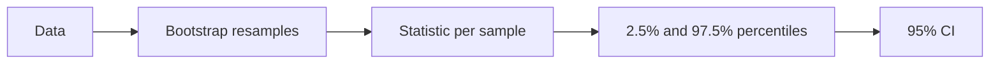

# Confidence Intervals

## Beginner-Friendly Intuition

A confidence interval is a range of plausible values for a quantity. A 95 percent CI says: if we repeated the experiment many times, the interval would contain the true value 95 percent of the time. It is not a probability statement about a single interval, but a long-run frequency property. CIs are how you communicate uncertainty without pretending you have a point estimate.

## Formal Explanation

For a sample mean with known variance, `CI = x_bar ± z (σ / sqrt(n))`. With unknown variance and small `n`, use the t-distribution. For binomials, Wilson or Clopper-Pearson are better than the normal approximation, especially near 0 or 1. For arbitrary statistics, bootstrap by resampling the data and computing the statistic many times.

## Why It Matters in Real Jobs

Reporting only a point estimate is a common cause of bad decisions. A 'lift of 5 percent' that has a CI of [-2 percent, 12 percent] is different from one with [4 percent, 6 percent]. CIs let stakeholders see the risk.

## How It Works Step by Step

1. Decide the statistic of interest (mean, proportion, ratio, AUC).
2. Pick a CI method matched to the statistic and sample size.
3. Compute or bootstrap the interval.
4. Communicate both the point estimate and the interval.
5. Check that the interval is narrow enough for the decision; if not, collect more data.

## Real-World Example

A model evaluation reports AUC 0.84 with a 95 percent CI of [0.79, 0.89]. The wide interval signals that the holdout is too small to be confident in fine model differences. Adding data narrows the CI; the comparison between two models becomes meaningful only after.

## Common Mistakes

- Reporting a point estimate with no interval.
- Stating that "there is a 95 percent probability that the true value lies inside this specific interval." That is a Bayesian credible-interval statement, not a frequentist confidence-interval statement. The frequentist statement is about the procedure: 95 percent of intervals constructed this way (across many hypothetical repetitions) would contain the true value. Once you have a specific interval, the true value is either in it or not; the 95 percent does not refer to that specific interval anymore. If you genuinely want the "95 percent probability the truth is here" interpretation, use a Bayesian credible interval with an explicit prior.
- Using a normal-approximation CI for a proportion near 0 or 1.
- Bootstrapping incorrectly. Always preserve the sampling unit: if your data has multiple rows per user and the metric is per-user, resample users (with replacement), not rows. Resampling rows underestimates variance because rows from the same user are not independent.
- Confusing CI with prediction interval. A CI bounds a parameter (the true mean). A prediction interval bounds a future single observation; it is wider.

## Interview Angle

**Question:** Explain a 95 percent confidence interval and how you would compute one for AUC.

**Strong answer:** A 95 percent CI is constructed so that, in repeated sampling, 95 percent of intervals contain the true value. For AUC, bootstrap by resampling the holdout (with replacement, preserving the unit of analysis), recompute AUC each time, and take the 2.5th and 97.5th percentiles. Or use the DeLong method for a parametric estimate.

**Weak answer:** Say the true value is 95 percent inside the interval (incorrect frequentist interpretation).

**Follow-up questions:**

- What is the difference between a CI and a prediction interval?
- How does sample size affect CI width?
- When is bootstrap inappropriate?
- What is a credible interval and how does it differ?

## Mini Exercise

Take any metric. Bootstrap a 95 percent CI from 1000 resamples. Note how the CI changes with sample size by subsampling 10 percent of the data.

## Diagram

---
## Navigation

[⬅ Previous](07-hypothesis-testing.md) | [🏠 Home](../README.md) | [➡ Next](09-correlation-vs-causation.md)
