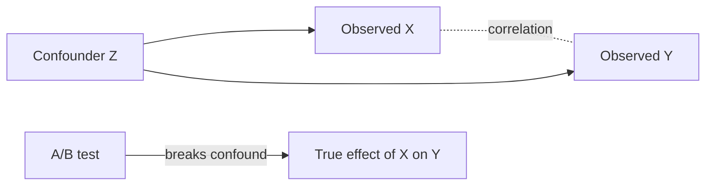

# Correlation vs Causation

## Beginner-Friendly Intuition

Two things move together does not mean one causes the other. Lurking variables (a third factor causing both), reverse causation, and selection bias all create correlation without causation. Real ML systems are full of correlated features that look causal but break under intervention.

## Formal Explanation

Causal inference asks `P(Y | do(X))`, the distribution of Y when we intervene on X, not just observe it. Randomized experiments break the lurking-variable problem because they assign X independently of confounders. Observational methods (instrumental variables, propensity scores, difference-in-differences, regression discontinuity) attempt to recover causal effects without random assignment, with assumptions.

## Why It Matters in Real Jobs

Models trained on observational data learn correlations. When deployed in a setting that changes the upstream cause, predictions break. Engineers who confuse correlation with causation ship models that work until they do not, often during the most important moments.

## How It Works Step by Step

1. Decide whether you need to predict or to understand what would happen under intervention.
2. If interventional, run an experiment (A/B test) when possible.
3. If not, identify confounders and use methods to adjust for them.
4. Be explicit about assumptions: which lurking variables you assume away.
5. Report effect sizes and uncertainty, with caveats about causal interpretation.

## Real-World Example

A team finds that customers who use feature X churn less. They make X mandatory and churn worsens. The original correlation came from highly engaged users self-selecting into X, not from X causing retention. An A/B test would have caught this; the observational analysis did not.

## Simpson's Paradox: Concrete Numbers

Two departments admit applicants. The aggregate numbers say women are admitted at a lower rate than men, suggesting bias. But each department's numbers tell the opposite story.

| Department | Men admitted | Men applied | Women admitted | Women applied |
| --- | --- | --- | --- | --- |
| Easy | 70 | 100 | 18 | 20 |
| Hard | 10 | 100 | 30 | 180 |
| **Total** | **80** | **200** | **48** | **200** |

Per-department admission rates: Easy admits 70 percent of men and 90 percent of women. Hard admits 10 percent of men and about 16.7 percent of women. Women have the higher admission rate in both departments. Aggregate rates are 40 percent for men (80/200) and 24 percent for women (48/200). Aggregate looks like men are favored. The reversal happens because women applied disproportionately to the Hard department, where everyone has a low admission rate, while men applied disproportionately to the Easy department. The lesson is that the aggregate hides the within-group structure; the right slice can flip the conclusion. The historical Berkeley admissions case is exactly this pattern.

## Confounding vs Selection Bias

- **Confounding.** A third variable causes both the treatment and the outcome, creating a non-causal correlation. "Ice cream sales correlate with drownings; the confounder is summer."
- **Selection bias.** The sample itself is not representative because of how it was collected. "Only users who completed onboarding are in the dataset; conclusions do not transfer to users who dropped out."

## Causal Inference Toolkit

When randomization is not possible, several methods recover causal effects under specific assumptions:

- **RCT (randomized controlled trial / A/B test).** Gold standard. Use whenever you can intervene.
- **Difference-in-differences (DiD).** Use when treatment is rolled out at a specific time to one group and not another, and parallel trends are plausible. Compares the change in outcome over time across the two groups.
- **Regression discontinuity (RDD).** Use when treatment is assigned by crossing a threshold (e.g., test score above 50 gets a scholarship). Compares units just above and just below the threshold.
- **Propensity score matching.** Use when you have many observed confounders and treatment assignment depends on them. Estimate the probability of treatment given covariates and match treated to control units with similar propensity.
- **Instrumental variables (IV).** Use when you have a variable that affects treatment but not the outcome directly (e.g., distance to clinic affects whether someone gets vaccinated but does not directly affect their later health outcome).
- **Synthetic control.** Use when you have one treated unit and many control units. Construct a weighted combination of controls that approximates the treated unit's pre-treatment trajectory.

Each method has assumptions that must be defended; observational causal claims are only as strong as the assumption that justifies them.

## Common Mistakes

- Treating regression coefficients as causal effects.
- Adjusting for variables that are downstream of the treatment (post-treatment bias).
- Forgetting that selection bias makes observational data unrepresentative.
- Using ML models to claim causal insight from purely observational data.

## Interview Angle

**Question:** How do you tell whether a model is learning a correlation or a causal effect, and why does it matter?

**Strong answer:** Pure ML models learn correlations. To establish causation, you need an intervention (A/B test) or strong assumptions plus a causal method (propensity scoring, instrumental variables, DiD). It matters because predictions about what will happen under a new policy require causal knowledge; observational correlations can flip when the upstream world changes.

**Weak answer:** Claim a model identifies causes simply because it predicts well.

**Follow-up questions:**

- What is Simpson's paradox?
- Why are randomized experiments the gold standard?
- When can observational data give causal insight?
- What is a confounder and how do you adjust for it?

## Mini Exercise

Take an observational claim from your data. Sketch a causal diagram. Identify at least one possible confounder and propose an experiment to test whether the relationship is causal.

## Diagram

---
## Navigation

[⬅ Previous](08-confidence-intervals.md) | [🏠 Home](../README.md) | [➡ Next](10-ab-testing.md)
