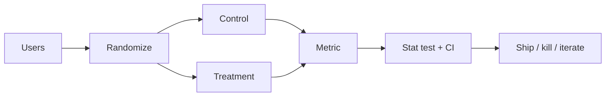

# A/B Testing

## Beginner-Friendly Intuition

An A/B test is a randomized experiment that splits users into a control and a treatment group, applies a change to the treatment, and measures the difference in a chosen metric. Randomization makes the groups comparable; the only systematic difference should be the treatment.

## Formal Explanation

Define the primary metric, the unit of randomization, and the duration. Compute sample size using `n ≈ 2 σ² (z_{α/2} + z_β)² / Δ²` where `Δ` is the minimum detectable effect. Run the test long enough to reach the planned size before peeking. Use stratified or blocked randomization to reduce variance. Analyze with a t-test for continuous metrics or a proportion test for binary; correct for multiple comparisons across secondary metrics. Watch for SUTVA violations (treatment effect spilling between users) and novelty/seasonality effects.

## Why It Matters in Real Jobs

Most product changes that look good in dashboards are noise; A/B tests filter the real wins. Big tech runs thousands of experiments per quarter. Engineers who can design and analyze them rigorously protect the company from shipping changes that hurt users.

## How It Works Step by Step

1. Define the user, the metric, and the minimum effect that matters.
2. Compute required sample size for desired power.
3. Randomize at the right unit (user, account, session) so spillover does not contaminate.
4. Pre-register hypotheses, sample size, and stopping rules.
5. Run for the planned duration; do not peek and stop early.
6. Analyze with confidence intervals and a check on guardrail metrics (latency, errors, revenue).

## Real-World Example

A search team A/B tests a new ranker. Click-through rate rises 1 percent (significant) but revenue drops 2 percent (significant). Looking only at the primary metric would have shipped a clearly bad change. Tracking guardrails saved the team from a regression.

## SUTVA, Switchback, and Long-Term Metrics

**SUTVA (Stable Unit Treatment Value Assumption)** is the assumption that one user's treatment does not affect another user's outcome. Standard A/B tests rely on it. SUTVA breaks when there are network effects: a treated user posts content that affects untreated users' feeds, or treated drivers in a marketplace change prices for untreated riders. When SUTVA breaks, the difference between treatment and control underestimates the true effect of a full rollout because the control is partially "treated" through spillovers.

**Switchback tests** address SUTVA violations in marketplaces and ride-hailing. Instead of randomizing users, you randomize time windows within a region: in San Francisco, on hour-long blocks, alternate treatment and control globally. Every user in that region experiences both arms, but at different times. The test still measures a marginal effect, with assumptions about temporal stability. Use switchback when treatment affects shared system state (price, supply, queue depth) and per-user randomization is contaminated.

**Long-term metrics** like 90-day retention, lifetime value, and trust take weeks or months to mature. Three strategies. First, **proxy metrics**: identify a fast-moving leading indicator (e.g., week-1 retention) that is known to correlate with the long-term metric, and gate the launch on the proxy with the long-term metric tracked as a follow-up. Second, **cohort holdout**: hold a small percentage of users out of the launch permanently and measure the long-term metric for that cohort over time. Third, **surrogate index**: train a model to predict the long-term metric from short-term signals and use the prediction as the experiment's outcome (with all the usual caveats about model drift). Each strategy trades one form of uncertainty for another; pick based on how costly a wrong launch is.

## Common Mistakes

- Stopping early when results look good (peeking inflates false positives).
- Randomizing at the wrong unit (treating sessions when users straddle treatments).
- Ignoring power and chasing tiny effects with too-small samples.
- Skipping pre-registration and trying many metrics until one is significant.
- Forgetting novelty effects: the first week may not represent steady state.

## Interview Angle

**Question:** Walk through how you would design an A/B test for a new recommendation algorithm.

**Strong answer:** Define the metric (e.g., long-term watch time per user) and minimum lift that matters. Compute sample size for 80 percent power. Randomize at user level to avoid contamination. Run a pre-launch sanity check on a small percentage of traffic. Pre-register hypotheses. Run for at least a week to capture day-of-week effects. Analyze with CI plus guardrails (latency, ad revenue, complaints). Decide based on practical and statistical significance.

**Weak answer:** Quote 'p < 0.05 ship it' without effect size, sample size, or guardrails.

**Follow-up questions:**

- What is the difference between SUTVA and SUTPA?
- When do you need a switchback test instead of a parallel A/B?
- How do you handle long-term metrics that take weeks to mature?
- What is a guardrail metric and why does it matter?

## Mini Exercise

Pick a feature you ship. Design the A/B test: metric, randomization unit, sample size, duration, guardrails, decision rule. One page.

## Diagram

---
## Navigation

[⬅ Previous](09-correlation-vs-causation.md) | [🏠 Home](../README.md) | [➡ Next](11-sampling-bias-and-data-leakage.md)
