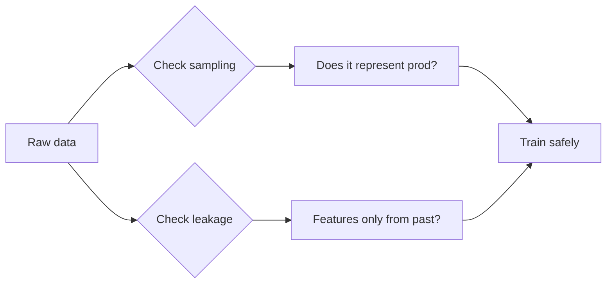

# Sampling Bias and Data Leakage

## Beginner-Friendly Intuition

Sampling bias means the data does not represent the population you care about. Data leakage means features carry information that would not be available at prediction time. Both produce models that look great offline and fail in production. They are the two most common causes of ML disasters.

## Formal Explanation

Selection bias: samples are not random with respect to the target (only loan acceptees, only past customers, only users who completed a flow). Survivorship bias: missing entities skew the analysis. Temporal leakage: a feature uses information from after the prediction time. Target leakage: a feature is a near-copy of the label. Train-test leakage: identical or near-duplicate items appear in both splits.

**Missingness mechanisms (MCAR / MAR / MNAR)** matter for sampling bias because the way data is missing tells you whether a complete-case analysis is unbiased.

- **MCAR (Missing Completely At Random).** Missingness does not depend on observed or unobserved variables. Complete cases are a random subsample; analysis is unbiased.
- **MAR (Missing At Random).** Missingness depends on observed variables but not on the missing value itself, given those observed variables. Model-based imputation (regression, MICE) restores unbiasedness if the model captures the dependency.
- **MNAR (Missing Not At Random).** Missingness depends on the missing value itself. There is no clean fix; you need either external data or a sensitivity analysis.

**Target leakage vs temporal leakage.** Target leakage means a feature is a near-copy of the label or directly derived from the label. Temporal leakage means a feature uses information that would not be available at the moment of prediction. Both produce inflated offline metrics. The single most useful test is the **prediction-time question**: for every feature, ask "would I have known this value at the moment the model is supposed to predict, in production?" If the answer is no, the feature leaks. Concrete examples. "Amount of late payments to date" updates after default, so at prediction time it would not have been seen; that is temporal leakage. "Refund issued" is generated only for transactions that a manual review later flagged as fraud; that is target leakage. Both push AUC to roughly 0.95 offline and crash it to roughly 0.6 online.

## Why It Matters in Real Jobs

These problems are silent. Validation looks great because the same bias contaminates the holdout. They surface only after deployment when real traffic exposes the gap. Engineers who learn to detect leakage early save weeks of cleanup.

## How It Works Step by Step

1. Map the timeline: when is each feature created relative to the prediction?
2. Identify the data-generating process. Who is in the dataset and who is not?
3. Run a 'leakage check' by training on shuffled labels; if performance is high, you have leakage.
4. Compare segment performance to global performance; gaps may indicate selection bias.
5. When deploying, log inputs to verify they match training distribution.

## Real-World Example

A loan default model includes 'amount of late payments to date' as a feature. In production, that field is updated continuously; when fed current values, the feature already contains the answer. AUC drops from 0.95 (offline) to 0.6 (online). Removing the leaky feature gives the real number.

## Common Mistakes

- Using post-event data as a feature.
- Random splits when grouping or time matters.
- Computing scaling or imputation parameters on the full dataset.
- Treating dropout from the funnel as random.
- Training only on positive cases (only past defaults), then evaluating on all loans.

## Interview Angle

**Question:** How would you audit a new dataset for sampling bias and leakage before training?

**Strong answer:** Map who is in the dataset and how they got there; ask which users are missing. Examine each feature for temporal validity and write down the exact moment it is computed. Run a sanity training on shuffled labels; high performance there is a red flag. Compare distributions of features across train, validation, and a fresh production sample.

**Weak answer:** Trust the data because it came from an internal warehouse.

**Follow-up questions:**

- What is the difference between selection bias and confounding?
- How would you detect train-test contamination?
- What logging would you add to verify training distribution matches production?
- How do you handle missing data without leaking?

## Mini Exercise

Pick a recent dataset. List every feature with the time it is computed. Circle any feature that might exist after the prediction time.

## Diagram

---
## Navigation

[⬅ Previous](10-ab-testing.md) | [🏠 Home](../README.md) | [➡ Next](12-statistics-for-interviews.md)
