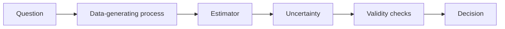

# Statistics for Interviews

## Beginner-Friendly Intuition

Statistics interviews test whether you can reason under uncertainty. The interviewer is usually not
looking for a memorized formula first. They want to know whether you can identify the population,
sample, metric, variation, assumption, and decision.

The practical pattern is: define what is being estimated, ask how the data was generated, quantify
uncertainty, check bias, and explain what decision can or cannot be made from the evidence.

## Formal Explanation

A statistics interview answer should connect:

- **Estimand:** the quantity or effect you want to know.
- **Data-generating process:** sampling method, assignment mechanism, missingness, measurement error,
  and dependence.
- **Estimator:** sample mean, proportion, regression coefficient, experiment lift, likelihood-based
  estimate, or other statistic.
- **Uncertainty:** standard error, confidence interval, posterior interval, p-value, power, or
  simulation.
- **Decision rule:** practical significance, guardrail metrics, business cost, and what evidence
  would change the decision.
- **Validity threats:** confounding, selection bias, leakage, multiple testing, peeking, non-stationary
  traffic, and Simpson's paradox.

## Why It Matters in Real Jobs

ML systems are measured with noisy data. Product launches, A/B tests, offline evaluations, model
comparisons, retention metrics, fairness checks, and monitoring alerts all require statistical
judgment. A confident but statistically weak conclusion can ship a worse product or hide harm to a
small segment.

Interviewers ask statistics questions because they reveal whether you understand evidence quality.
The strongest answers separate "the metric moved" from "the product improved because of our
change."

## How It Works Step by Step

1. **Clarify the question.** Estimate a mean, compare groups, test a change, predict uncertainty, or
   infer cause.
2. **Describe the data.** Explain how observations were sampled, assigned, logged, and filtered.
3. **Choose the method.** Use confidence intervals, hypothesis tests, regression, bootstrap,
   Bayesian reasoning, or experiment design based on the question.
4. **Check assumptions.** Independence, randomization, distribution shape, sample size, stationarity,
   and missingness matter.
5. **Interpret practically.** Discuss effect size, uncertainty, power, guardrails, and whether the
   result changes a decision.
6. **Name risks.** Confounding, selection bias, leakage, multiple comparisons, and delayed outcomes
   should be explicit.

## Real-World Example

A product team runs an A/B test for a new recommendation ranking model. Click-through rate improves
by two percent, but session length drops and new-user retention is flat. A strong statistical answer
checks randomization, sample size, confidence interval, novelty effects, guardrail metrics, segment
effects, and whether the observed lift is practically meaningful.

The decision might be to continue the test, ship to a subset, or roll back despite a statistically
significant click lift if guardrails show worse long-term user value.

## Common Mistakes

- Treating p-value as the probability the hypothesis is true.
- Ignoring effect size and practical significance.
- Claiming causality from observational data without addressing confounding.
- Peeking at experiments repeatedly without adjustment.
- Averaging over segments where treatment effects differ.
- Forgetting sample ratio mismatch, logging bugs, and missing data.
- Using offline model metrics as if they prove online product impact.

## Interview Angle

Interviewers use statistics prompts to test rigor and communication.

**Question:** An experiment shows a statistically significant improvement in conversion. Do you
launch?

**Strong answer:** Check experiment validity, sample ratio, guardrail metrics, confidence interval,
effect size, segment results, novelty effects, and business cost. Launch only if the effect is
credible, meaningful, and not offset by guardrail regressions.

**Weak answer:** Launch because p is less than 0.05.

**Follow-up questions:**

- What is the difference between confidence and prediction intervals?
- How would you explain power to a product manager?
- What would make an A/B test invalid?
- How do you reason about causality without randomization?

## Mini Exercise

Pick one metric from a case study: fraud loss, churn, click-through rate, answer faithfulness, or
unsafe action rate. Define the estimand, sampling process, estimator, uncertainty measure, validity
threat, and launch decision rule.

## Diagram

---
## Navigation

[⬅ Previous](11-sampling-bias-and-data-leakage.md) | [🏠 Home](../README.md) | [➡ Next](../data-science/01-data-science-workflow.md)
