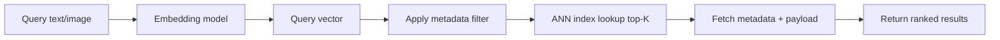

# What Is a Vector Database

## Beginner-Friendly Intuition

A vector database stores high-dimensional vectors (embeddings) and answers
the question "what items are most similar to this query vector?" at large
scale and low latency. The query is typically itself an embedding produced
from a piece of text, an image, or any other input the embedding model
understands. The database returns the top-K nearest neighbors by some
similarity score, optionally filtered by structured metadata, optionally
sorted by a secondary signal.

The intuition: a traditional database answers questions like "give me rows
where price < 50 and category = 'shoes'." A vector database answers "give
me rows whose embedding is most similar to this query embedding, optionally
also where category = 'shoes'." The first is exact lookup; the second is
nearest-neighbor search. The two are complementary, not competing.

In 2026, "vector database" can mean a dedicated service (Pinecone, Weaviate,
Qdrant, Milvus), a feature in a general-purpose database (PostgreSQL with
pgvector, MongoDB Atlas, Elasticsearch with kNN, OpenSearch), or a library
embedded in your application (FAISS, hnswlib, ChromaDB). Picking the right
shape is the engineering question.

## Formal Explanation

A vector database has four components.

- **Storage layer.** Stores the embedding vectors plus their metadata
  (document ID, source, owner, timestamps, ACL, language, etc.). A
  production system has 10K to 10B+ vectors with dimensions from 64 to
  4096.
- **Index layer.** A data structure that allows fast approximate nearest
  neighbor (ANN) search. Common choices: HNSW, IVF + product quantization,
  DiskANN. Brute-force exact search is `O(N · d)` per query and only
  practical up to about 100K vectors.
- **Query API.** Take a query vector plus optional metadata filter, return
  top-K nearest neighbors with scores. Modern systems also support hybrid
  queries (sparse + dense), batched queries, and namespacing per tenant.
- **Operations.** Insertion, deletion (often soft, then compaction),
  index versioning, snapshots, replication, sharding, monitoring.

### Vector DB vs traditional DB

A traditional B-tree is built around equality and range queries on scalar
fields. It cannot index "near in 1024-dim Euclidean space" because there
is no clean ordering in high dimensions. ANN indexes are designed
specifically for this: they trade a small amount of recall for a huge
speedup over linear scan.

A traditional DB still wins for: structured filters, transactional
consistency, joins, aggregations. A vector DB wins for: semantic search,
recommendation candidates, RAG retrieval, anomaly detection on embeddings.
Most production systems use both.

### Scale tiers

Roughly:

- **Up to ~100K vectors.** Exact search in NumPy or FAISS-flat is fine.
  Latency under 10 ms on modern CPUs. No ANN index needed.
- **100K to ~5M vectors.** pgvector with HNSW or IVFFlat index, or a
  small Qdrant/Weaviate instance. Single-node serving is enough.
- **5M to ~500M vectors.** Dedicated vector DB with sharding. Memory
  budget becomes the binding constraint; consider IVF + PQ for
  compression.
- **500M+ vectors.** Distributed system, sometimes with disk-based
  indexes (DiskANN), tiered storage (hot in memory, cold on disk),
  multi-region replication.

### Latency and throughput

A typical production budget per query: 5 to 30 ms for ANN lookup,
plus 1 to 5 ms for metadata filtering, plus 10 to 100 ms if a
cross-encoder reranker is added. Throughput depends on tail latency
control, batching, and connection pooling; well-tuned systems handle
1000 to 10000 QPS per node.

## Why It Matters in Real Jobs

Three production roles. First, **the retrieval substrate of every RAG and
semantic search system**. Without a vector DB, retrieval at scale is
impractical. Second, **recommendation candidate generation**: the two-tower
retrieval pattern from
[`recommender-systems/06-candidate-generation-and-ranking.md`](../recommender-systems/06-candidate-generation-and-ranking.md)
runs on a vector index. Third, **model memory**: agents and assistants
often store interaction history as embeddings for later retrieval.

The common mistake at the design stage is reaching for a dedicated vector
DB before checking whether pgvector or even an in-process FAISS index
would suffice. For most teams below 5M documents, pgvector keeps the
operational footprint small (one fewer system to monitor) at acceptable
performance.

## How It Works Step by Step

1. **Pick an embedding model.** Decide dimension, language coverage, and
   licensing. See [`02-embeddings.md`](02-embeddings.md).
2. **Define the schema.** Vector field plus metadata fields the queries
   will filter on (owner, language, freshness, ACL). The schema decides
   what filters can be cheap and what must be post-filtered.
3. **Choose a storage and index strategy.** Exact for small data,
   HNSW for moderate latency-sensitive, IVF + PQ for large memory-
   constrained. See [`04-indexing-hnsw-ivf-pq.md`](04-indexing-hnsw-ivf-pq.md).
4. **Pick a similarity metric.** Cosine, dot product, or Euclidean. Match
   the metric to how the embedding model was trained.
   See [`03-similarity-search.md`](03-similarity-search.md).
5. **Pick a vector DB.** Dedicated (Pinecone, Qdrant, Weaviate, Milvus)
   or general-purpose (pgvector, Elasticsearch, OpenSearch). See
   [`08-vector-db-selection.md`](08-vector-db-selection.md).
6. **Index the corpus.** Embed each document, write to the DB. Plan for
   re-embedding when the model changes (a major operational task).
7. **Query.** Embed the query, ANN-lookup top-K, optionally filter, then
   return.
8. **Operate.** Monitor recall (against an exact-search baseline on a
   sample), latency percentiles, write throughput, and stale-document
   rates.

## Real-World Example

A 30-person SaaS company stores 800K product descriptions and customer
reviews. Their first attempt: pgvector with HNSW (`m = 16,
ef_construction = 200`). Memory usage is ~3 GB; query latency p99 is 12
ms; recall@10 against exact search is 0.97. They serve from a single
PostgreSQL instance that already runs the rest of the app.

Six months later, the corpus reaches 12M items and per-tenant
isolation requirements arrive. They migrate to Qdrant with namespace
per tenant, scalar quantization for compression, and HNSW. They keep
PostgreSQL as the source of truth and treat Qdrant as a secondary index
that can be rebuilt from scratch if anything goes wrong. Cross-tenant
queries are explicitly forbidden at the application layer to satisfy
the new privacy constraints.

The lesson: vector DB choice tracks scale. Start with pgvector if you
already run Postgres. Move to a dedicated DB when memory, multi-tenancy,
hybrid search, or operational features push you out of pgvector's
comfort zone.

## Common Mistakes

- Reaching for a dedicated vector DB at 100K vectors when FAISS or
  pgvector would do. Operational cost is real.
- Picking a metric that does not match how the embedding model was
  trained (e.g., Euclidean on cosine-trained sentence-transformers).
- Storing only the vector and the document ID, no metadata. Metadata
  filtering becomes impossible without re-architecture.
- Using approximate search without ever measuring recall against exact.
  Recall can silently drift to 0.7 with no error signal.
- Not planning for re-embedding when the model changes. The index must
  be rebuilt; the schema must support index versioning.
- Mixing two embedding models in the same index. Vectors from different
  spaces are not comparable.
- Treating soft deletes as free. Old vectors remain in the index until
  compaction; queries can return tombstones.
- Forgetting permissions. Filtering by ACL after retrieval can leak
  whether a document exists, even if not its content.

## Interview Angle

**Question:** When would you NOT use a dedicated vector database, and
what alternatives would you reach for?

**Strong answer:** A dedicated vector DB adds operational overhead: a
new system to monitor, scale, back up, and authenticate. That overhead
is justified when scale, multi-tenancy, hybrid search, or specialized
features (filtered search at high recall, geo-distribution) demand it.
Below those bars, simpler options often win.

Three concrete alternatives.

First, **PostgreSQL with pgvector**. Adds a vector column type plus
HNSW or IVFFlat index. Comfortable up to 5M to 10M vectors per table
on a single Postgres instance. Wins because Postgres is already running
in most stacks; no new system, transactional consistency with the rest
of the app, mature tooling. Loses on very large scale, on workloads with
heavy metadata filtering combined with vector search, and on
specialized hybrid scoring.

Second, **Elasticsearch or OpenSearch with kNN**. If text search is
already running on Elastic, the kNN plugin lets you add vector search
in the same query path. Useful when you need lexical (BM25) and dense
search combined with rich filters. Loses on raw vector-search latency
relative to Qdrant or Pinecone.

Third, **in-process FAISS or hnswlib**. The index lives inside your
application. No network hop, lowest latency, simplest operations.
Works well up to a few million vectors and a single replica. Falls
apart with multiple replicas (each must hold the full index in memory),
cross-node consistency, and large mutable corpora.

Choose by scale and operational appetite. For 50K vectors and a single
service, in-process FAISS. For 500K to 5M with Postgres in the stack,
pgvector. For 50M+ or multi-tenant SaaS, a dedicated vector DB. The
question is rarely "which is fastest" but "which adds the least overall
complexity for my scale and team."

**Weak answer:** "Always use Pinecone." A senior interview probes for
the engineering tradeoff, not for a vendor preference.

**Follow-up questions:**

- What is the operational cost of running pgvector versus Pinecone?
- How would you migrate from pgvector to a dedicated DB without
  downtime?
- When does Elasticsearch with kNN beat a dedicated vector DB?
- How do you measure that your ANN index has acceptable recall?

## Mini Exercise

Pick a corpus you have access to (notes, code, customer support tickets).
Sketch the schema: vector field, metadata fields, ACL representation.
Estimate the corpus size in 12 months. Pick a storage tier from the
list above and justify in two sentences.

## Diagram

---
## Navigation

[⬅ Previous](../llms/17-llm-interview-patterns.md) | [🏠 Home](../README.md) | [➡ Next](02-embeddings.md)
