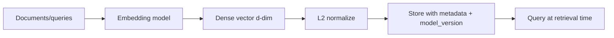

# Embeddings

## Beginner-Friendly Intuition

An embedding is a dense vector representation of an input (text, image,
audio, code) where semantic similarity in the input maps to geometric
proximity in the vector space. Two paragraphs about cooking land near
each other. Two paragraphs about quantum mechanics land near each other.
A paragraph about cooking and a paragraph about quantum mechanics land
far apart. Once you have this property, semantic search reduces to
nearest-neighbor lookup.

The intuition that matters: an embedding is a learned, lossy projection
that throws away most of the input but preserves the dimensions a
downstream task cares about. A sentence-transformer trained for retrieval
preserves dimensions that distinguish topical similarity. A code
embedding preserves dimensions that distinguish function semantics. A
multimodal embedding (CLIP, SigLIP) preserves dimensions that align
images with their captions. The same input can have many different
useful embeddings; you pick the one whose training objective matches
your task.

## Formal Explanation

### How embedding models are trained

Modern text embedding models are trained with **contrastive learning**.
Given anchor `q`, positive `p` (related to `q`), and negatives `n_1, ...,
n_k` (unrelated), train the model to make `sim(q, p) > sim(q, n_i)` for
all `i`. Standard loss: InfoNCE.

```
L = - log( exp(sim(q, p) / τ) / Σ_i exp(sim(q, n_i) / τ) )
```

`τ` is a temperature parameter. Negatives can be sampled in-batch, mined
from the corpus (hard negatives), or generated synthetically.

This procedure is what produces the geometry where semantic neighbors
land close together. The choice of positives and negatives is the
strongest design decision: pairs of (query, relevant document) train a
retrieval model; pairs of (sentence, paraphrase) train a similarity
model; pairs of (image, caption) train a multimodal model.

### Choosing the dimension

Common dimensions: 384, 768, 1024, 1536, 3072. Tradeoffs:

- **Quality.** Higher dimensions can capture more distinctions, up to a
  point. The MTEB leaderboard shows clear gains from 384 -> 768 and
  modest gains beyond.
- **Memory.** A 1M-vector index at 1536 dim with float32 is 6 GB raw;
  at 384 dim it is 1.5 GB. Multiply by replicas and shards.
- **ANN speed.** Higher dimensions cost more per distance computation;
  for HNSW the per-query cost grows roughly linearly in `d`.
- **Storage cost.** A direct multiple of dimension and bytes per element.

Modern embedding APIs (OpenAI text-embedding-3, Cohere v3, Voyage v2)
support **Matryoshka representation learning**: you can truncate the
output (e.g., from 3072 to 512) with a small quality loss but
significant cost savings. Many production systems store the full
dimension and query with a truncated prefix.

### Normalization

Most retrieval-trained embedding models output unit-norm vectors (or
expect you to L2-normalize at inference). On normalized vectors, cosine
similarity equals dot product, which is faster on most ANN indexes.
When in doubt, normalize before storing.

The exception: dot-product-trained recommenders (two-tower with raw
inner product) sometimes produce intentionally unnormalized vectors
where magnitude carries information ("popularity" or "confidence"); see
[`../math/12-distance-metrics.md`](../math/12-distance-metrics.md). For
generic semantic-search embeddings, normalize.

### Language and domain coverage

Embedding models have biases toward their pretraining distribution. A
generic English-centric model embeds Spanish or Hindi worse than a
multilingual one (E5-multilingual, BGE-M3, Cohere multilingual). A
generic web-text model embeds legal contracts or biomedical papers
worse than a domain-tuned one. Always test on a sample of production
data before committing.

### Embedding model landscape

Closed-source hosted (2026):

- **OpenAI text-embedding-3-small (1536, supports truncation), -large
  (3072).** Strong general-purpose English; good multilingual.
- **Cohere embed-v3 (1024) and embed-multilingual-v3.** Strong on
  English and 100+ languages.
- **Voyage AI voyage-3 (1024) and voyage-large-2 (1536).** Often top
  of the MTEB leaderboard.

Open-source (downloadable):

- **BGE-M3 (1024).** Multilingual, dense + sparse + colbert outputs in
  one model. Strong baseline.
- **E5-large-v2 (1024) and E5-mistral-7b-instruct.** Microsoft's
  retrieval-trained models.
- **Nomic-embed-text-v1.5 (768).** Open weights, good for
  on-premise deployment.
- **GTE-large.** Strong general-purpose; permissive license.

For images and multimodal:

- **CLIP and SigLIP** (OpenAI / Google). Image-text alignment;
  zero-shot classification.
- **Marqo, Vertex multimodal, Voyage multimodal**.

The right choice depends on language coverage, dimension budget,
licensing, on-premise need, and benchmark performance on data that
resembles yours. Treat MTEB as a starting hint, not a final answer.

### Versioning and migration

The embedding model is part of the index contract. Changing the model
invalidates all stored vectors. Every production system must answer
two questions before launch:

1. How is the model version stored alongside each vector? (Recommended:
   add a `model_version` metadata field; refuse queries that mix.)
2. What is the migration plan when the model upgrades? (Standard:
   build a new index in parallel, dual-write for a window, switch
   reads, then retire the old index.)

Skipping the version field is the most common cause of silent quality
regressions in production retrieval.

## Why It Matters in Real Jobs

Three production reasons. First, **the embedding model is the largest
quality lever in retrieval**. A better model often beats a fancier
index, a fancier reranker, or a fancier prompt. Second, **embedding
choice is locked in at index time**. Changing later means re-embedding
the entire corpus; for a 100M-doc corpus that is hours to days of
compute and money. Third, **embeddings are the interface** between
retrieval, RAG, and recommendation. Picking sensibly here saves
downstream pain.

## How It Works Step by Step

1. **Identify the data type and language.** Text, image, code,
   multilingual, domain-specific.
2. **Pick a candidate model from the landscape.** Match dimension,
   licensing, and language coverage.
3. **Build a small evaluation set.** 50 to 500 (query, relevant
   document) pairs from your domain. Without it, you cannot compare
   models honestly.
4. **Benchmark.** Recall@10 and NDCG@10 on the eval set. Compare
   candidates. The MTEB leaderboard is a starting hint, not a
   substitute.
5. **Pick by quality and cost.** Often a smaller open-source model
   beats a larger hosted one on domain data, at a fraction of the
   cost.
6. **Normalize at write time.** L2-normalize before storing if the
   model expects it.
7. **Add `model_version` to metadata.** Critical for migration.
8. **Plan the migration recipe.** Dual-index pattern; never
   rebuild-in-place.
9. **Monitor.** Per-segment recall against your eval set; periodic
   rerun to catch silent drift.

## Real-World Example

A team builds an internal documentation search system. Languages:
English (70 percent), Spanish (15 percent), Portuguese (10 percent),
mixed code/text (5 percent). They benchmark four models on a 200-pair
eval set drawn from their wiki:

- text-embedding-3-small (1536): NDCG@10 0.71. Cost: ~$0.02 per million
  tokens.
- BGE-M3 (1024, self-hosted): NDCG@10 0.74. Cost: ~$0.001 per million
  tokens (own GPU).
- Voyage-3 (1024): NDCG@10 0.78. Cost: ~$0.06 per million tokens.
- Cohere embed-multilingual-v3 (1024): NDCG@10 0.76. Cost: ~$0.10 per
  million tokens.

They pick BGE-M3 self-hosted: best price-quality, full multilingual
support, and they already operate GPU servers for other ML. They
add `model_version = "bge-m3-v1"` to every vector in the metadata.
Six months later, BGE-M3-v2 is released with measurable gains; they
build a parallel index, dual-write for two weeks, switch read traffic,
and retire v1. No quality regression.

## Common Mistakes

- Picking a model from the MTEB leaderboard without testing on your
  data. Domain shift is real.
- Mixing dimensions or models in one index without versioning. Vectors
  from different models are not comparable.
- Forgetting to normalize when the model expects unit-norm inputs.
  Cosine and dot product diverge silently.
- Using English-only embeddings on multilingual content. Recall on
  non-English queries collapses.
- Picking the highest dimension by default. 384 or 768 is often within
  1-3 NDCG points of 1536 at a quarter of the storage and latency
  cost.
- Building a 10M-doc index without an evaluation harness. You cannot
  detect silent quality regressions.
- Confusing similarity-trained models (sentence pair similarity) with
  retrieval-trained models (query-document). Their geometry differs.

## Interview Angle

**Question:** Walk through how you would choose an embedding model for
a new RAG system over a 5M-doc corpus that is 70 percent English and
30 percent multilingual.

**Strong answer:** Start with constraints. 5M docs makes hosted-API
embeddings expensive at index time (a one-time 5M-call cost) and at
query time (per-call cost forever). Multilingual rules out English-only
models. The plan.

First, build an evaluation harness. 100 to 500 (query, relevant
document) pairs labeled by SMEs across the language mix. Without it,
no comparison is honest.

Second, candidate set. BGE-M3 (1024 dim, multilingual, open weights),
Cohere embed-multilingual-v3 (1024, hosted, strong multilingual),
Voyage-multilingual (hosted), text-embedding-3-large with
multilingual data (hosted, generic-strong). Run all on the eval set.
Report NDCG@10 per language and overall.

Third, pick by quality vs cost on the actual data. If BGE-M3 self-
hosted is within 3 NDCG points of the best hosted option, pick it
because the cost difference at 5M docs and steady query traffic is
substantial. If a hosted model is dramatically better, pay for it.

Fourth, dimension decision. Start at the model's native dimension. If
1024 dim with HNSW costs more than budget, evaluate truncation (for
Matryoshka-trained models like text-embedding-3) or scalar quantization
on the index side.

Fifth, lock in versioning from day one. Add `embedding_model_version`
as required metadata; refuse queries from a different version; plan
the dual-index migration recipe.

Sixth, plan operations. Re-embedding 5M docs takes hours to days; size
batch jobs accordingly. Monitor recall against the eval set quarterly;
rerun benchmarks when new models ship. Budget for one model upgrade
per year as a baseline.

What I would not do. Pick by MTEB leaderboard alone (domain shift).
Mix English and multilingual models in the same index. Skip the
versioning field. Use a 3072-dim model when 768 would do.

**Weak answer:** "Use OpenAI embeddings." That ignores cost,
multilingual quality, and hosted-vs-self-hosted tradeoffs.

**Follow-up questions:**

- What is contrastive training and why is it the default?
- How does Matryoshka representation learning work?
- How would you detect that an embedding model is degrading on your
  corpus?
- What is the difference between similarity-trained and retrieval-
  trained models?

## Mini Exercise

Pick three embedding models from the landscape above. Build a 50-pair
eval set from any text corpus you have. Compute NDCG@10 for each
model. Note the gap between the best and worst, and the cost
difference per million queries.

## Diagram



---
## Navigation

[⬅ Previous](01-what-is-a-vector-database.md) | [🏠 Home](../README.md) | [➡ Next](03-similarity-search.md)
