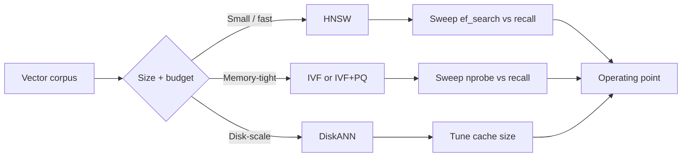

# Indexing: HNSW, IVF, and PQ

## Beginner-Friendly Intuition

An ANN index is a clever data structure that lets you find approximate
nearest neighbors without scanning every vector. The three patterns you
need to know in 2026: **HNSW** (graph-based, great latency, expensive
memory), **IVF** (cluster-based, more memory-efficient, slightly worse
recall at the same latency), and **PQ** (compression on top of either,
trades recall for big memory savings). Real production systems often
combine them: HNSW for the smaller hot tier, IVF + PQ for the large cold
tier, both behind the same query API.

The intuition for the tradeoff: brute-force kNN is `O(N · d)` per query,
which is fine to about 100K vectors and fails above. Every ANN method
trades a controlled bit of recall (typically 1-10 percent) for a 100x to
10000x latency win. The art is picking the right method and tuning its
exploration parameter to hit your latency-recall-memory budget.

## Formal Explanation

### HNSW (Hierarchical Navigable Small World)

A multi-layer graph (Malkov and Yashunin, 2018). Each vector is a node;
edges connect each node to a small set of approximate neighbors at
several "layers" of the graph. The top layer is sparse and connects
distant nodes; lower layers are denser and connect close nodes.

Query: enter at the top layer, greedily walk toward the nearest neighbor,
descend to the next layer, repeat until you reach the bottom. Return the
top-K from the bottom-layer search.

Three knobs:

- **`M`** (typical 16-64). Maximum number of bidirectional edges per
  node. Higher M = more memory and slightly higher recall.
- **`ef_construction`** (typical 100-500). Search width during index
  build. Higher = slower build, higher recall.
- **`ef_search`** (typical 32-512). Search width at query time. Higher
  = higher recall, higher latency. **The main runtime tunable.**

Memory: roughly `4 (d + M) · N` bytes for float32 vectors plus graph,
so a 10M-vector 1024-dim HNSW with M=16 is ~80 GB. The graph alone is
significant.

Strengths: lowest latency at high recall. Best choice when memory is
abundant and latency matters most.

Weaknesses: memory-hungry. Inserts mutate the graph (rebuilds are
expensive). Build time scales superlinearly with `N`.

### IVF (Inverted File Index)

Cluster-based. Run k-means on a sample of vectors to produce `nlist`
centroids (typical 100-65536). Each vector is assigned to its nearest
centroid; the inverted file maps centroid -> list of vectors.

Query: find the `nprobe` nearest centroids to the query, scan only the
vectors in those lists.

Two knobs:

- **`nlist`** (typical `sqrt(N)`). Number of clusters. Higher = smaller
  per-cluster lists = faster query at the cost of recall.
- **`nprobe`** (typical 1-100). How many clusters to search per query.
  **The main runtime tunable.** Higher = higher recall, higher
  latency.

Memory: just the vectors plus a small centroid table. For 10M 1024-dim
vectors with float32: ~40 GB raw, no graph overhead.

Strengths: lower memory than HNSW. Inserts are cheap (just append to
the right list). Easier to update.

Weaknesses: at the same recall, typically slower than HNSW. Quality
depends on how well clusters partition the data; struggles when the
embedding distribution has no clear cluster structure.

### PQ (Product Quantization)

A compression scheme on top of either HNSW or IVF. Split each vector
into `m` sub-vectors of dimension `d/m`, run k-means within each
sub-vector space to learn a codebook of `2^bits` centroids per
sub-vector (typical bits = 8). Store each vector as `m` centroid IDs
instead of `d` floats.

Compression ratio: from `4 · d` bytes (float32) to `m · bits / 8`
bytes. Typical: 1024-dim float32 (4096 bytes) -> PQ with `m = 64,
bits = 8` (64 bytes), a 64x compression.

Recall cost: 2-10 percent depending on data and bits. Mitigated by:

- Higher `bits` (16 bit codes) for less compression but better recall.
- **Reranking with raw vectors:** retrieve top 100 with PQ, then re-
  score the top 100 with the original float32 vectors. Standard
  technique.

PQ is what makes 100M+ vector indexes fit in memory at all.

### Scalar quantization

Simpler than PQ. Quantize each dimension independently: float32 -> int8
or even int4. Compression ratio: 4x or 8x. Recall cost: usually under
1 percent at int8.

Easier to implement than PQ; standard in pgvector, Qdrant, Pinecone.
Most teams should try scalar quantization before reaching for PQ.

### DiskANN

Memory-saving variant designed for billion-vector scale. Index lives
on SSD; only a small graph cache stays in memory. Per-query latency
20-100 ms (versus 1-10 ms for in-memory HNSW), but enables corpora
that do not fit in RAM. Used at very large scale (100M+ to billions).

### ANN library landscape

- **FAISS** (Meta). Battle-tested C++ library; supports flat, HNSW,
  IVF, PQ, GPU acceleration. The reference implementation; almost
  everything else borrows from it.
- **hnswlib.** Lightweight pure-HNSW C++ library. What pgvector and
  many others embed.
- **ScaNN** (Google). Specialized IVF + asymmetric quantization;
  competitive on speed at high recall.
- **Annoy** (Spotify). Random-projection trees; older, lower quality
  than HNSW, still used in some systems.
- **Vamana / DiskANN** (Microsoft). The graph algorithm behind
  DiskANN.

Most modern vector DBs use HNSW (Pinecone, Qdrant, Weaviate) or a mix
(Milvus supports both HNSW and IVF). pgvector supports HNSW and IVFFlat.

### Reading a recall-latency curve

Sweep the runtime parameter (`ef_search` for HNSW, `nprobe` for IVF)
across a wide range. Measure recall@K against exact and per-query
latency. Plot recall on x-axis, latency on y-axis. The curve has a
characteristic shape: latency rises sharply as recall approaches 1.0.
Pick the highest-recall point that fits your latency budget.

Different methods produce different curves. HNSW typically dominates
IVF in the recall > 0.9 region; IVF can win at lower recall with much
less memory.

## Why It Matters in Real Jobs

Three production reasons. First, **the index is the latency-quality
knob in retrieval**. Tuning it correctly is the difference between a
100 ms search and a 5 ms search at the same quality. Second, **memory
budget often dictates the choice**. At 100M vectors, plain HNSW does
not fit on a single node; PQ or DiskANN becomes necessary. Third,
**ANN behavior is invisible without measurement**. Recall drift from
corpus changes, parameter drift, or version upgrades can silently
collapse retrieval quality.

## How It Works Step by Step

1. **Estimate corpus size and growth.** Pick the index family by
   memory budget at projected size.
2. **Pick the metric.** Match the embedding model.
3. **Pick the index family.** HNSW for speed-first, moderate scale.
   IVF or IVF + PQ for memory-first, large scale. DiskANN for
   billion-scale.
4. **Build a recall ground truth.** Exact search on a 100K-1M
   sample.
5. **Build the ANN index** with default parameters.
6. **Sweep the runtime parameter.** Plot recall vs latency. Pick
   the operating point.
7. **If memory is tight, add PQ or scalar quantization.** Re-measure
   recall with reranking on raw vectors.
8. **Document parameters and operating point.** Future-you will
   thank present-you.
9. **Re-measure recall periodically.** Drift is silent.

## Real-World Example

A team has 25M document embeddings (1024 dim, normalized). Single
node, latency budget 50 ms p99, recall target 0.95.

Plan A: in-memory HNSW. Memory at `M = 16`: roughly 100 GB
(`4 · (1024 + 16) · 25M`). Single-node is feasible only on a 128 GB
machine; expensive. They sweep `ef_search`: at 64, recall 0.93,
latency 5 ms. At 128, recall 0.96, latency 9 ms. Picks 128, ships.

A year later, corpus reaches 80M. Memory needed for plain HNSW: 320
GB, prohibitively expensive. They migrate to IVF + scalar quantization
(int8). Memory drops to ~25 GB. They sweep `nprobe`: at 32, recall
0.91, latency 4 ms; at 64, recall 0.94, latency 8 ms. They add
reranking on float32 vectors of the top 200 candidates: recall 0.97
at 14 ms total. Stays within budget at a quarter of the memory cost.

The lesson: index choice tracks scale. HNSW until memory hurts, then
IVF + quantization plus reranking.

## Common Mistakes

- Using FAISS-flat (exact) on a million-vector index when ANN would
  serve. Latency suffers for no reason.
- Skipping the recall measurement after switching index types or
  parameters.
- Picking `ef_construction` too low; the index is fast to build but
  recall ceiling is permanently capped.
- Using PQ without reranking; recall drops are visible.
- Forgetting that HNSW deletes are soft (mark-as-deleted); old
  vectors stay in the graph until rebuild.
- Treating `M` and `ef_search` as independent. They interact; sweep
  jointly if memory is tight.
- Building HNSW once and never rebuilding. Inserts degrade graph
  quality over time; periodic rebuild restores recall.
- Picking IVF without tuning `nlist`. Default `nlist = 100` is wrong
  for most production scales.

## Interview Angle

**Question:** Compare HNSW, IVF, and PQ. When would you pick each?

**Strong answer:** All three are ANN techniques but solve different
parts of the recall-latency-memory triangle.

**HNSW** is a hierarchical graph index. Each vector is a node; edges
connect to approximate nearest neighbors at multiple layers. Query is
a greedy descent through the graph. Two main parameters: `M` (edges
per node, set at build) and `ef_search` (exploration width at query
time, the runtime knob). HNSW typically achieves the lowest latency
at high recall (greater than 0.95). The cost is memory: the graph
itself is significant, and each vector stays as float32 unless you
add quantization on top. Choose HNSW when latency matters most and
memory is acceptable. Production default for moderate scale (1M to
100M vectors).

**IVF (Inverted File Index)** is cluster-based. K-means partitions the
vectors into `nlist` clusters; queries probe the `nprobe` nearest
clusters. Two parameters: `nlist` at build, `nprobe` at query. IVF
uses far less memory than HNSW (no graph) and is faster to update
(just assign new vectors to a cluster). At the same recall, IVF
typically loses 1-3 ms to HNSW. Choose IVF when memory matters more
than the last few ms of latency, or when the corpus has frequent
inserts that an HNSW graph would not handle gracefully.

**PQ (Product Quantization)** is a compression scheme, not a
standalone index. It splits each vector into sub-vectors and replaces
each sub-vector with a centroid ID, often saving 8x to 64x memory.
Always combined with HNSW or IVF (HNSW + PQ, IVF + PQ). Recall drops
2-10 percent without reranking; rerank the top-K candidates against
the original float32 vectors to recover most of that loss. Choose PQ
when memory is the binding constraint, typically above 50M vectors
without aggressive cost optimization.

In practice, the decision tree.

- Up to ~5M vectors: HNSW alone. Memory is fine.
- 5M to 100M, latency-critical: HNSW. Add scalar quantization (int8)
  if memory tight.
- 100M to 1B, memory-critical: IVF + PQ + reranking. Recall recovers,
  memory drops 10-50x.
- Above 1B or disk-resident: DiskANN. Latency higher (20-100 ms) but
  scale is feasible.

A senior engineer's instinct: never choose without measuring on the
target data. The HNSW-vs-IVF-vs-PQ question is a constraint puzzle
(memory, latency, recall, build time), not a fixed answer.

**Weak answer:** "Always use HNSW because it has the best recall."
Ignores memory and update characteristics.

**Follow-up questions:**

- How do you tune `ef_search` to hit a recall target?
- What is reranking with raw vectors and why does it help PQ?
- When does scalar quantization beat PQ?
- What is DiskANN and when do you reach for it?

## Mini Exercise

Take any 100K-vector dataset. Build three indexes with FAISS:
flat (exact), HNSW with `M = 32, ef_search = 64`, IVF with `nlist =
1000, nprobe = 16`. Measure recall@10 and per-query latency for
each. Plot the recall-latency tradeoff.

## Diagram

---
## Navigation

[⬅ Previous](03-similarity-search.md) | [🏠 Home](../README.md) | [➡ Next](05-metadata-filtering.md)
