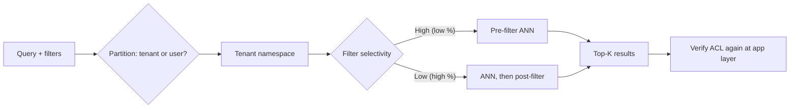

# Metadata Filtering

## Beginner-Friendly Intuition

Metadata filtering attaches structured constraints to a similarity search:
"return the top-K most similar vectors **where owner = user_42 AND
language = 'en' AND created_at > 2024-01-01**." Without it, your retrieval
returns the wrong language, exposes content the user is not allowed to
see, or returns six-year-old data when only the last 30 days matters.
Filtering is what turns a vector index from a research demo into a
production system.

The intuition that production engineers learn quickly: **how** the filter
is applied matters as much as **what** is filtered. Apply the filter
before the ANN search and recall stays clean but latency depends on
filter selectivity. Apply it after and latency stays predictable but
recall collapses if the filter is selective. The right answer is
filter-strategy-dependent, not a global default.

## Formal Explanation

### Pre-filter, post-filter, and the middle ground

Three strategies, each with characteristic tradeoffs.

**Pre-filter (filtered ANN).** Restrict the candidate set to vectors
matching the filter, then ANN over the restricted set. Recall is
preserved. Latency depends on selectivity:

- High selectivity (filter keeps 10 percent of corpus): the index has
  to navigate around forbidden vectors; HNSW especially can be slow
  because the graph was built without the filter in mind.
- Low selectivity (filter keeps 80 percent): close to unfiltered cost.

Modern vector DBs (Qdrant, Weaviate, Pinecone, Milvus) implement
filtered ANN with optimized graph traversal that skips non-matching
nodes. Performance depends heavily on the implementation.

**Post-filter.** ANN-search top-K (typically 2x to 10x the desired
output), then drop results that fail the filter. Predictable latency,
but **recall collapses on selective filters**. If the filter keeps 5
percent of the corpus and you retrieve top-100, you might end up with
1-5 results post-filter; for top-10 final output, that is broken.

**Hybrid (multi-stage).** Pre-filter when the filter is selective,
post-filter when it is not. Or: ANN-search a generous top-K (300-1000),
then post-filter, with a fallback to pre-filter if too few survive.
Production systems often have both code paths.

### Why pre-filter changes recall

ANN indexes (HNSW especially) are tuned to navigate the original vector
distribution. When pre-filtering, the index walks through a sparser
subgraph; the navigation heuristics that worked on the full graph can
miss neighbors. Some implementations re-tune `ef_search` upward when a
filter is active. Always re-measure recall under filtering, with a
representative filter distribution; recall under filter is often 5-15
points below recall without filter at the same `ef_search`.

### Filter types

- **Equality.** `category = 'shoes'`. Cheapest; can use a hash index.
- **Set membership.** `category IN ('shoes', 'boots')`. Cheap.
- **Range.** `price BETWEEN 50 AND 200`, `created_at > '2024-01-01'`.
  Needs a sorted index; range scans add cost.
- **Boolean combinations.** `(category = 'shoes' OR brand = 'X') AND
  language = 'en'`. The query planner combines indexes; complex
  combinations can blow latency.
- **Geospatial.** Lat/lon within radius. Specialized index (geohash,
  R-tree).
- **Full-text on metadata.** Filter by keyword match in a non-vector
  field. Requires a separate inverted index.

Most vector DBs support equality, set, and range filters natively;
fancier filters often require dropping to a hybrid query layer
(Elasticsearch + vector search, or pgvector + standard SQL where).

### Permissions and ACL

The most production-critical filter type: **does the user have
permission to see this document?** Patterns:

- **Per-user ACL.** `allowed_users` array. Filter `user_id IN
  allowed_users`. Simple but the array can be large for shared docs.
- **Per-group ACL.** `allowed_groups` array. The user's group membership
  is computed at query time; filter on intersection.
- **Hierarchical ACL.** A document inherits permissions from its parent
  folder. Resolved at query time by walking the ACL tree, then
  filtering.
- **Row-level security in pgvector.** PostgreSQL RLS policies enforce
  ACL at the SQL layer; vector queries automatically respect them.

The recurring bug: applying ACL filtering as a post-filter, then
returning fewer results than requested. Permission boundaries change
behavior at high recall; always pre-filter on permissions.

### Selectivity and latency

Filter selectivity = fraction of corpus matching the filter. A useful
mental model:

- **Above 50 percent:** post-filter is fine. Pre-filter has minor
  benefit, sometimes adds overhead.
- **5-50 percent:** depends. Measure both. Pre-filter typically wins
  on recall; post-filter wins on latency variance.
- **Below 5 percent:** pre-filter is essential. Post-filter would
  drop too many candidates.

Production systems sample query distributions to estimate selectivity
per filter type and route accordingly. Some DBs (Qdrant) expose a
`filter_strategy` parameter per query.

### Filter on partition key

A useful pattern when one filter dominates (e.g., per-tenant SaaS).
**Partition the index by the dominant filter value.** Each tenant gets
a separate index (or namespace, or shard). Queries hit only their
tenant's index; the filter becomes structural rather than runtime.

Tradeoffs: tenant-isolation security improves; cross-tenant queries
become impossible (often desired); index management cost grows linearly
with tenant count. For SaaS with hundreds of tenants this is standard;
for SaaS with millions of tiny tenants you need a different design
(group small tenants into shared shards, partition large tenants
alone).

## Why It Matters in Real Jobs

Three production reasons. First, **without ACL filtering, your search
leaks**. Showing a user a document they should not see is a compliance
incident, sometimes a regulatory one. Second, **filter strategy is the
hidden quality bug**. Latency-driven post-filter on a selective ACL
silently returns near-empty results to users with restricted views.
Third, **partition design at index creation determines what is cheap
forever after**. Choosing the wrong partition key forces expensive
multi-shard fan-out for the rest of the system's life.

## How It Works Step by Step

1. **List all filters** the queries will use. Tenant ID, language,
   freshness, ACL, category, etc.
2. **Estimate selectivity** for each filter type from production
   query logs (or representative samples).
3. **Choose partition key** for the dominant filter (typically tenant
   or owner). Partition the index accordingly.
4. **Pick filter strategy per filter** based on selectivity. Pre-filter
   ACL and selective filters; post-filter for low-selectivity filters.
5. **Test the strategy** on representative queries with realistic
   filter values. Measure recall and latency under filter.
6. **Add safety bounds.** Maximum candidates returned, fallback to
   pre-filter if post-filter returns too few results.
7. **Monitor in production.** Per-filter recall, per-filter latency,
   filter selectivity drift over time.

## Real-World Example

A team builds a document search for a legal tech product. Queries
include tenant_id (one law firm), case_id, document_type (contract,
brief, opinion), date range, and ACL (which lawyers in the firm can see
this document).

Architecture decisions.

- **Partition by tenant_id.** Each firm gets its own namespace.
  Cross-firm queries are forbidden by design; ACL leakage at the firm
  boundary is prevented structurally.
- **Pre-filter ACL.** Within a tenant, lawyer-level permissions vary
  by case. ACL is selective (a partner sees ~80 percent of cases; a
  junior associate sees ~20 percent). Post-filter on ACL would
  produce empty results for juniors. Pre-filter is mandatory.
- **Pre-filter case_id when present.** Highly selective.
- **Post-filter document_type and date range.** Low selectivity in
  most queries; post-filter is fine.

Implementation: Qdrant with one collection per firm. Filters in the
search request use Qdrant's filtered ANN. They sweep `ef_search` and
candidate count; settled on retrieving 200 candidates with pre-filter,
post-filtering on type and date. Recall@10 against exact-search
ground truth: 0.96. Latency p99: 32 ms.

Six months later, a new document type arrives ("memo") that constitutes
50 percent of new corpus growth. Some queries explicitly want only
memos; selectivity is now bimodal. They keep the same architecture but
add a filter-routing rule: when document_type is in the filter and
selectivity below 30 percent, switch to pre-filter on type as well.

## Common Mistakes

- Post-filtering ACL. The first time a user reports "I cannot find my
  document" you discover post-filter dropped it.
- Not partitioning the index by the dominant filter. Multi-shard
  queries hit every shard; latency variance explodes.
- Treating filter selectivity as static. New tenants, new categories,
  and new document types shift the distribution.
- Mixing filters from different metadata schemas in the same index.
  ACL in one schema and not in another invites leakage.
- Forgetting that filtered ANN often has lower recall than unfiltered
  at the same `ef_search`. Re-measure with the filter active.
- Storing ACL as a giant array of user IDs. At 100K users, the array
  itself becomes a liability. Use group-based or hierarchical ACL.
- Skipping per-filter monitoring. Aggregate recall is fine; the rare
  filter combinations may be broken.

## Interview Angle

**Question:** Walk through how you would design metadata filtering for
a multi-tenant RAG system over a 50M-document corpus where each user
has their own permissions.

**Strong answer:** Three architectural decisions and one operational
discipline.

First, **partition by tenant**. Each tenant (organization) gets a
separate namespace, collection, or index. Cross-tenant queries are
forbidden at the application layer; the partitioning makes that
structural. Benefits: tenant-level data isolation for compliance,
no cross-tenant ACL leakage at the boundary, simpler per-tenant
quotas and billing. Cost: more index objects to manage; mitigated
with infrastructure-as-code and per-tenant lifecycle automation.

Second, **pre-filter ACL within each tenant**. Within a tenant, users
have document-level permissions that vary widely. Post-filter on ACL
would silently return near-empty results to users with restricted
views (e.g., a contractor who sees 5 percent of the corpus). Pre-filter
is the only correct choice. The cost is filtered-ANN latency overhead;
typically 1.2x to 2x the unfiltered cost depending on the
implementation.

Third, **route filter strategy by selectivity**. ACL pre-filter is
mandatory; other filters (document type, date range, language)
get pre-filter or post-filter based on observed selectivity. Use a
fallback: ANN-search with a generous candidate count (200-500),
post-filter, and if too few survive, fall back to pre-filter. This
handles the long tail without paying full pre-filter cost on every
query.

The operational discipline: **measure per-filter recall.** A periodic
job runs representative filtered queries against an exact-search
ground truth and reports recall under filter. Aggregate recall stays
clean even when a specific filter combination silently regresses.

What I would not do. Single global index for all tenants (operational
nightmare; one tenant's bad query can poison the cache for others).
Post-filter on ACL (compliance failure mode). Hardcoded filter
strategy without measurement (long-tail filters break silently).
Storing all permissions as an array on each document (does not scale).

What I would also include in the design doc. ACL representation
(per-user array vs per-group set vs hierarchical inherited). Index
versioning and reindex strategy. Cache key design (must include
filter signature so cache hits respect ACL). Per-tenant rate limits.

**Weak answer:** "Add a filter to the query." Misses the partition,
the strategy choice, and the ACL pre-filter requirement.

**Follow-up questions:**

- Why does pre-filter affect ANN recall?
- How would you partition for SaaS with 1M small tenants?
- How do you implement hierarchical ACL efficiently?
- What is row-level security in pgvector?

## Mini Exercise

Pick a real corpus (your notes, a public dataset). List the metadata
fields a query might filter on. For each, estimate selectivity and
choose pre-filter or post-filter. Identify the field that should be
the partition key.

## Diagram

---
## Navigation

[⬅ Previous](04-indexing-hnsw-ivf-pq.md) | [🏠 Home](../README.md) | [➡ Next](06-hybrid-search.md)
