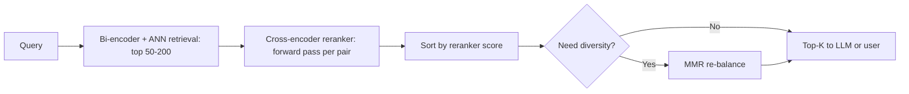

# Reranking

## Beginner-Friendly Intuition

Reranking is a second pass over a small set of retrieved candidates,
with a more expensive and more accurate model, to reorder them before
showing the top-K to the user (or feeding them to an LLM). The first
stage (bi-encoder retrieval, BM25, or hybrid) is fast but coarse; the
second stage is slow but precise. Together they produce results that
neither stage alone can match, at a latency that brute-force per-pair
scoring could never achieve.

The intuition: bi-encoder retrieval encodes query and documents
independently, then compares vectors. The model never sees the query
and document together. A **cross-encoder** does see them together,
running a transformer over their concatenation, and produces a
relevance score that is dramatically more accurate. The cost is
proportional to the number of (query, document) pairs scored, so
cross-encoders only run on the top-K from retrieval, not the whole
corpus.

In 2026, hybrid retrieval + cross-encoder reranker is the modern
production stack for serious retrieval systems. The reranker typically
adds 3-10 NDCG points over a strong bi-encoder retrieval baseline.

## Formal Explanation

### Bi-encoder vs cross-encoder

**Bi-encoder.** Two encoders (often shared weights) produce
independent vectors for query and document. Score is a similarity
metric (cosine, dot product) on the two vectors. Fast: encode the
corpus once offline; encode the query once at runtime; ANN search
finds the top-K.

**Cross-encoder.** A single transformer over the concatenation
`[query] [SEP] [document]`. Outputs a single relevance score. Sees
query-document interactions directly. Far more accurate at the cost
of running a forward pass per pair: cannot precompute, must run
online per (query, document) pair.

The two-stage pattern: bi-encoder retrieves top 50-200, cross-encoder
reranks them, top 5-20 are returned. The cross-encoder runs over a
small candidate pool, so its high per-pair cost is bounded.

### Reranker model landscape (2026)

Open-source:

- **MiniLM-cross-encoder** (cross-encoder/ms-marco-MiniLM-L-6-v2):
  classic; small (22M params), fast, decent quality.
- **bge-reranker-v2-m3** (BAAI). Multilingual, 568M params; strong
  default for high-quality reranking. Slower but worth it.
- **bge-reranker-large** (560M). English-strong.
- **Jina reranker v2** (multilingual, smaller).

Hosted (closed):

- **Cohere Rerank v3** (multilingual, English, code variants). Strong
  and well-tuned; per-call cost.
- **Voyage rerank-2** (English).

A 2026 production starting point: **bge-reranker-v2-m3 self-hosted**
for multilingual; **Cohere Rerank** for hosted. Benchmark on your data
before committing.

### Latency budget

A cross-encoder forward pass is typically 5-50 ms per (query,
document) pair on a modern GPU, depending on model size and
sequence length. Total reranker latency is roughly:

```
latency ≈ candidate_count · per_pair_latency / parallelism
```

For 50 candidates, a 568M-param reranker on a single GPU: ~80-150 ms
total. Batched: 30-60 ms. CPU-only: 10x slower; usually impractical
for serious rerankers.

Common operating points:

- **Top-50 candidates, large reranker, GPU.** 50-100 ms. Standard for
  high-quality production retrieval.
- **Top-100 candidates, large reranker, GPU.** 100-200 ms. Better
  recall at top-K.
- **Top-20 candidates, small reranker, CPU.** 20-50 ms. Cheap fallback
  for low-traffic systems.

### How many candidates to rerank?

The reranker can only reorder what retrieval returned. If retrieval
missed a relevant document, the reranker cannot recover it. So:

- **Retrieval recall must be high.** Aim for recall@K of 0.9+ at the
  candidate count you rerank.
- **More candidates = better recall, more latency.** Sweep candidate
  count vs final NDCG; pick the smallest count that hits target
  quality.

A common recipe: hybrid retrieval at top-100, rerank with a
cross-encoder, return top-10. Increase to top-200 if NDCG@10 keeps
improving.

### MMR for diversity

After reranking, the top results may all come from the same document
or cluster. **Maximum Marginal Relevance** rebalances:

```
MMR_score(d) = λ · rerank_score(d) - (1 - λ) · max sim(d, selected)
```

`λ` controls the relevance-vs-diversity tradeoff (typical 0.5-0.8).
Lower lambda = more diverse output.

Used heavily in RAG to avoid feeding the LLM five paragraphs from the
same source page.

### Position-bias correction

If the system logs user clicks for training, the cross-encoder can
exploit position bias from the bi-encoder's ranking. Train rerankers
on click data only with position-bias correction (training-time
position feature, IPS weighting, or simply training on judged data
not click logs).

### When to skip the reranker

Not every retrieval system needs a reranker. Skip when:

- Latency budget is below 50 ms total. Reranker rarely fits.
- Bi-encoder retrieval is already strong (NDCG@10 > 0.85). Marginal
  gain may not justify cost.
- Use case is offline batch retrieval where a few hundred ms is fine
  but you do not have GPUs available.
- Cost per query is dominated by reranker (e.g., low-revenue
  consumer-facing search). Quantization or smaller reranker first.

## Why It Matters in Real Jobs

Three production reasons. First, **the reranker is often the largest
quality lever** in retrieval. 5+ NDCG points is the difference between
"users notice" and "users do not notice." Second, **the reranker is
where latency is spent**; understanding the budget matters for
engineering decisions. Third, **reranker model selection is its own
discipline**: different models suit different domains, and a domain
mismatch can erase the lift.

## How It Works Step by Step

1. **Confirm retrieval recall is high enough.** Reranker cannot
   recover missing documents.
2. **Pick a candidate count** (start with 50). Larger = higher recall
   ceiling, more reranker latency.
3. **Pick a reranker model.** bge-reranker-v2-m3 for multilingual
   open-source default; Cohere Rerank for hosted.
4. **Benchmark on your eval set.** Compare retrieval-only NDCG@10 to
   retrieval + reranker NDCG@10. The lift should justify the latency
   cost.
5. **Measure latency** per candidate count. Identify the operating
   point that meets your SLA.
6. **Add MMR for diversity** if the top results clump.
7. **Quantize the reranker** (int8, FP16) if latency is tight.
8. **Cache reranker scores** for popular query-document pairs if hit
   rate is high.
9. **Monitor in production.** Reranker latency, fallback rate, NDCG
   drift on a held-out eval set.

## Real-World Example

A team builds a documentation search system. Hybrid retrieval (BM25 +
dense) yields NDCG@10 = 0.71 on their 200-pair eval set; latency
~15 ms.

They add bge-reranker-v2-m3 over the top 50 candidates, GPU-served:
NDCG@10 = 0.78, latency p99 = 95 ms (15 ms retrieval + 80 ms
reranker). Within their 200 ms budget; they ship.

Six months later, the corpus and query traffic both grow 5x. Reranker
GPU costs become the largest line item in the inference bill. They
switch to a smaller reranker (MiniLM-L-12) over top-30: NDCG@10 = 0.74
(0.04 worse than bge-large, 0.03 better than retrieval alone),
latency 35 ms, cost down 70 percent. They keep the larger reranker as
a per-query option ("high quality search" toggle for paid tier).

## Common Mistakes

- Adding a reranker without measuring whether retrieval recall
  supports it. The reranker cannot fix missing candidates.
- Reranking too many candidates (top-500+). Latency blows up; quality
  plateau is reached around top-50.
- Picking a reranker by parameter count rather than benchmark on
  domain data. Smaller models can win.
- Running a cross-encoder on CPU at scale. 10x latency for marginal
  cost savings.
- Caching reranker scores without including model version in the
  cache key. A reranker upgrade silently serves old scores.
- Skipping MMR when results are highly clustered. The user sees five
  near-identical paragraphs.
- Mixing rerankers for different query types without per-type
  evaluation. Quality varies.
- Forgetting that reranker latency is sensitive to sequence length.
  Long documents inflate cost; truncate or use a windowed approach.

## Interview Angle

**Question:** When does a reranker help, and how do you decide
between a bi-encoder and a cross-encoder for the reranking step?

**Strong answer:** A reranker helps when the bi-encoder retrieval
returns a high-recall but imperfectly-ranked top-K. The bi-encoder
encodes query and documents independently; the cross-encoder sees
them together and can model query-document interactions that the
bi-encoder cannot. The typical NDCG@10 lift is 3-10 points,
depending on the corpus and the rerankers compared.

The deciding question for bi-encoder vs cross-encoder reranking:

A **cross-encoder** runs a transformer over `[query] [SEP] [document]`
and outputs a single score. Each query-document pair is an
independent forward pass. Cost is `O(K · forward_pass)` per query, so
cross-encoders are only practical on a small candidate pool (top
50-200). At that scale, the lift is large and worth the latency. This
is the standard production reranker.

A **stronger bi-encoder** could in principle close the gap. The
problem is the bi-encoder must encode the corpus offline (one
embedding per document, stored in the index). Switching to a stronger
bi-encoder means re-embedding the corpus and rebuilding the index, a
multi-hour-to-day operation, plus more index storage cost. And the
gap from a cross-encoder is rarely fully closable because the
bi-encoder fundamentally cannot see query-document interactions at
scoring time.

So the standard pattern is: a moderately-strong bi-encoder plus
hybrid retrieval as the first stage (cheap, indexed offline), and a
strong cross-encoder reranker on the top-50 candidates (expensive but
runs only on a small set). Each stage plays its role.

For picking the cross-encoder:

- **Open-source default in 2026:** bge-reranker-v2-m3 for multilingual
  or bge-reranker-large for English. Self-host on a GPU.
- **Hosted default:** Cohere Rerank v3.
- **Latency-constrained:** smaller cross-encoders (MiniLM, ms-marco-
  MiniLM-L-6) at the cost of 1-3 NDCG points.

When to skip the reranker entirely: when latency budget is below
~50 ms, when the bi-encoder is already strong (NDCG@10 > 0.85), or
when corpus and query traffic are too small to justify the
operational complexity.

A senior engineer's instinct: do not assume the reranker is needed;
measure the retrieval-vs-retrieval+reranker NDCG gap on a labeled
eval set before paying the latency cost. The lift is usually worth
it for serious systems, but production has a way of surprising you.

**Weak answer:** "Always rerank with the largest model." Ignores
latency, cost, and the diminishing-return curve.

**Follow-up questions:**

- What is MMR and when do you use it?
- How do you decide candidate count for the reranker?
- When does a stronger bi-encoder beat adding a reranker?
- How would you reduce reranker latency at fixed quality?

## Mini Exercise

Take a small labeled retrieval dataset. Implement bi-encoder
retrieval (top-50). Then add a cross-encoder reranker (e.g.,
ms-marco-MiniLM-L-6). Compute NDCG@10 for retrieval-only and
retrieval+reranker. Note the gap and the latency cost.

## Diagram



---
## Navigation

[⬅ Previous](06-hybrid-search.md) | [🏠 Home](../README.md) | [➡ Next](08-vector-db-selection.md)
