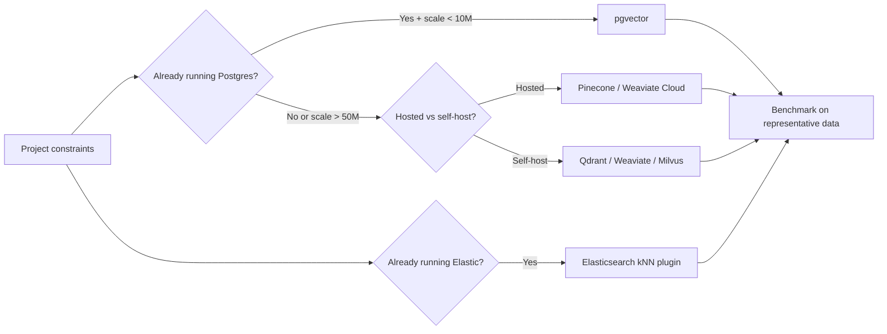

# Vector Database Selection

## Beginner-Friendly Intuition

Picking a vector database is mostly about constraints, not vendor
preference. The right answer depends on your existing stack, the scale
you have today and project for 12 months, your latency budget, your
multi-tenancy requirements, your hybrid search needs, and how much
operational complexity your team can absorb. Everything else (recall
quality, hybrid search support, ANN algorithm choice) is reachable from
multiple vendors; the constraints decide which is the easiest fit.

The intuition for the decision: above 90 percent of teams overshoot.
Reaching for Pinecone or Milvus when pgvector would have served is a
common mistake; the dedicated vector DB adds an extra system to monitor,
back up, scale, and authenticate, in exchange for capabilities that
matter only at larger scale. The senior engineer's question is not "is
this DB good?" but "what is the simplest system that meets my
constraints for the next 12-24 months?"

In 2026, the practical decision tree starts with: do I already run
PostgreSQL? Do I have under 5M vectors? Then pgvector is the default.
Otherwise, dedicated vector DB.

## Formal Explanation

### The candidate set (2026)

**Hosted (managed):**

- **Pinecone.** The classic. Hosted-only. Strong on serverless scaling,
  hybrid search, namespacing per tenant. Premium pricing.
- **Weaviate Cloud.** Hosted variant of open-source Weaviate. Hybrid
  search, GraphQL API, tenant isolation.
- **Qdrant Cloud.** Hosted Qdrant. Strong filtered search, sparse
  vectors, multi-tenancy.
- **Vespa Cloud.** Hosted Vespa. Mature ranking pipeline, hybrid scoring,
  large-scale battle-tested.
- **Pinecone serverless / Turbopuffer / Lance.** Newer entrants
  optimized for cost-per-query at scale.

**Self-hosted (open source):**

- **Qdrant.** Rust-written, Apache 2.0. Strong filtered search; growing
  ecosystem.
- **Weaviate.** Go-written, BSD-3. Hybrid search; GraphQL API.
- **Milvus.** Go and C++, Apache 2.0. Mature; large-scale-friendly;
  more operational complexity.
- **Chroma.** Python-written, Apache 2.0. Embedded or single-server;
  prototyping-friendly.
- **Vespa.** Battle-tested at Yahoo scale; complex to operate.
- **OpenSearch.** Apache 2.0. Has kNN plugin; strong if you already
  run it for text search.

**General-purpose with vector support:**

- **PostgreSQL with pgvector.** PostgreSQL extension. Adds vector
  type and HNSW/IVFFlat index. Best for moderate scale (under 5-10M
  vectors per table) when Postgres is already in the stack.
- **Elasticsearch.** Has dense_vector field type plus kNN scorer; good
  if you already run Elastic for text search.
- **MongoDB Atlas Vector Search.** Adds vector search to Atlas. Useful
  for stacks already on MongoDB.
- **Redis with RediSearch.** Vector search in a Redis-resident index.
  Lowest latency for small-corpus, low-write workloads.
- **DuckDB.** Local analytics with vector support; good for batch.

The list keeps growing; the categorization is more stable than the
vendor list.

### Decision matrix

The criteria that actually matter:

- **Scale.** Vectors at launch and at 12-24 months. Below 5M, almost
  any option works. Above 100M, the field narrows.
- **Latency budget.** Under 10 ms p99 needs in-memory HNSW. 10-50 ms
  is comfortable for most. Above 100 ms allows DiskANN or
  cost-optimized options.
- **Hybrid search.** Need BM25 + dense fused? Some DBs (Weaviate,
  Vespa, Pinecone, Elasticsearch, OpenSearch) support it natively;
  others (Qdrant) require app-side fusion.
- **Filtering.** Need pre-filter on selective metadata? Quality of
  filtered ANN varies; Qdrant and Weaviate are particularly strong
  here.
- **Multi-tenancy.** Hard isolation per tenant? Pinecone namespaces,
  Qdrant collections, separate indexes per tenant in pgvector.
- **Deletion semantics.** Soft delete vs hard delete; how compaction
  works; whether stale vectors persist in the index.
- **Update frequency.** Heavy writes hurt HNSW (graph mutation);
  IVF-based or write-friendly designs (Qdrant, Vespa) are better.
- **Hosting model.** Hosted (Pinecone, Weaviate Cloud) vs self-hosted
  (Qdrant, Milvus) vs in-stack (pgvector, Elasticsearch).
- **Existing stack.** Do you already operate PostgreSQL? Elasticsearch?
  Free vector capability that comes with what you already run is
  usually the right starting point.
- **Cost.** Hosted DBs charge per vector or per query; self-hosted
  charge engineer time and infrastructure. At scale, the math
  changes.

### When pgvector is enough

pgvector wins when:

- Corpus is under 5-10M vectors per table.
- Postgres is already in the stack.
- Multi-tenancy can be modeled by row-level security.
- Hybrid search requirements are modest (you can combine pgvector and
  PostgreSQL `tsvector` BM25 in one SQL query, fuse application-side).
- Operational simplicity matters more than the last 5 ms of latency.

The cost of "moving to a dedicated vector DB" is real: a new system to
monitor, a new authentication boundary, a new failure mode, a new
backup-and-restore procedure. Many teams pay this cost without needing
the capability.

### When you need a dedicated vector DB

Dedicated wins when:

- Corpus is 50M+ vectors and growing.
- Latency budget under 20 ms p99 with high recall.
- Multi-tenancy at scale (1000+ tenants), where namespace isolation
  is structural.
- Native hybrid search at high quality (Pinecone, Weaviate, Vespa).
- Native filtered ANN at high recall under selective filters
  (Qdrant, Weaviate).
- Heavy write workload (frequent updates, deletes); pgvector's index
  cannot keep up.
- Distributed deployment (sharding, replication, multi-region) is
  needed.

### Operational discipline regardless of choice

Whatever you pick:

- Track the embedding model version per record.
- Plan a reindex / migration recipe before you need it.
- Monitor recall@K periodically against an exact-search ground truth.
- Log query latency p50/p95/p99 per index.
- Test failure modes: index unavailable, partial reindex, embedding
  model upgrade, soft-delete buildup.

## Why It Matters in Real Jobs

Three production reasons. First, **the wrong choice locks in months of
pain** before migration becomes possible. Second, **the right choice is
not the fanciest one**; pgvector beats Pinecone for most teams under
5M vectors. Third, **operational cost is invisible at decision time**:
a new system in the stack adds dashboards, on-call burden, version
upgrades, and security review forever.

## How It Works Step by Step

1. **Estimate scale at launch and in 12-24 months.** Vectors and QPS.
2. **List constraints.** Latency, hybrid search needs, multi-tenancy,
   filter requirements, hosting model.
3. **Identify what is already in the stack.** PostgreSQL, Elasticsearch,
   Redis. Existing systems with vector support are the cheapest
   starting point.
4. **If projected scale stays under 5-10M and Postgres is present,
   pick pgvector.** This handles most "build a RAG system at our
   company" projects.
5. **Otherwise, narrow to 2-3 candidates** that match the constraints.
6. **Build a small benchmark.** 100K vectors, representative queries.
   Measure recall, latency, hybrid quality, filter latency.
7. **Test operations.** Backup, restore, reindex, embedding-model
   upgrade, scale-up, scale-down.
8. **Pick by total cost (engineering + infrastructure) over 12 months,
   not by raw query latency.**

## Real-World Example

A small B2B SaaS team building an internal documentation search.
~500K documents, growing 30 percent/year. Already runs PostgreSQL for
the application; team of 4 engineers; latency budget 100 ms; English
+ a few European languages.

They evaluate three options.

- **pgvector.** Already in the stack. HNSW index in 8 GB RAM. NDCG@10
  on their eval: 0.72. Latency p99: 18 ms. Operational cost: zero new
  systems.
- **Qdrant self-hosted.** Strong filtered ANN. NDCG@10: 0.74. Latency
  p99: 6 ms. Operational cost: one new service, monitoring,
  authentication, backup.
- **Pinecone.** Hosted. NDCG@10: 0.74. Latency p99: 22 ms. Cost: $200/
  month at their scale, scaling to $1500/month at projected size.

They pick pgvector. The 0.02 NDCG gap and the 12 ms latency gap are
real but small; the operational savings are large. Two years later,
corpus reaches 8M and per-tenant isolation becomes a hard requirement;
they migrate to Qdrant. The cost of "starting with pgvector and moving
later" was lower than "starting with Pinecone and never migrating."

A different team: a consumer-facing search at 100M+ vectors, multi-
language, 50 ms latency budget, 1000+ tenants. pgvector is not viable;
they pick Pinecone (hosted, autoscaling, namespaces) for development
speed, accept the cost, and revisit when scale or cost demand a
self-hosted move.

## Common Mistakes

- Reaching for a dedicated vector DB at 100K vectors. pgvector or
  even FAISS-flat would do; the new system is operational debt.
- Picking by vendor brand without benchmarking on your data.
- Overlooking existing stack capabilities (Elasticsearch with kNN,
  PostgreSQL with pgvector). Free capabilities are still capabilities.
- Underestimating operational cost of self-hosted (Qdrant, Milvus,
  Vespa). They are excellent but require monitoring, backups, and
  upgrades.
- Choosing for hybrid search when you do not need hybrid search.
- Not testing the migration path before locking in.
- Assuming hosted vendors will scale infinitely; price-per-query at
  100M vectors and 100 QPS can dominate the budget.
- Not including the cost of egress, replication, multi-region in
  hosted estimates.

## Interview Angle

**Question:** A team needs to add semantic search over 2M product
documents. They already run PostgreSQL. What do you recommend, and
when would you change your mind?

**Strong answer:** Default recommendation: **pgvector** with HNSW.
Reasoning.

The constraint set: 2M vectors is a comfortable scale for pgvector.
The team already operates PostgreSQL, so adding pgvector is a
PostgreSQL extension install plus an index, not a new system. With a
1024-dim embedding and HNSW M=16, the index fits in roughly 12 GB
RAM, which most production Postgres instances handle. Latency on
HNSW with `ef_search = 64`: typically 5-15 ms p99 at recall 0.95+.
That meets virtually any production budget. Backups, replication,
authentication, monitoring, and on-call all use the existing
PostgreSQL operations.

I would change my mind in five scenarios.

1. **Hard multi-tenancy at scale.** If the product serves 1000+
   tenants with strict per-tenant isolation, pgvector's row-level
   security works but creates noisy-neighbor risk on a single
   PostgreSQL instance. A dedicated vector DB with namespaces (Pinecone,
   Qdrant) gives structural isolation.

2. **Heavy write workload.** If documents update frequently (thousands
   per second), HNSW graph mutation in pgvector starts to bottleneck.
   IVF-based or write-optimized DBs (Qdrant, Vespa) handle this
   better.

3. **Latency budget under 5 ms.** pgvector adds Postgres overhead
   (connection, planning) on top of the index lookup. A dedicated
   in-memory vector DB removes the overhead.

4. **Native hybrid search at high quality.** If queries combine
   keyword and semantic in non-trivial ways, Weaviate / Vespa /
   Pinecone hybrid scoring is more sophisticated than what you can
   build on top of pgvector + tsvector.

5. **Projected scale beyond 50M vectors.** pgvector at that scale
   needs aggressive partitioning and dedicated read replicas; a
   dedicated DB is operationally simpler.

If I had to choose a non-pgvector option for the team:

- **Self-host first preference: Qdrant.** Strong filtered ANN, modern
  Rust implementation, growing ecosystem. Fits a Postgres-running
  team better than Milvus's complexity.
- **Hosted preference: Pinecone.** Mature, straightforward
  multi-tenancy, autoscaling. Pay the premium when speed-to-market
  matters and ops capacity is constrained.

The general principle: do not add a system unless the constraints
demand it. The cost of "I should have started with pgvector" is much
lower than the cost of "I added a vector DB I did not need and now we
have two systems to operate."

**Weak answer:** "Use Pinecone, it is the standard." Ignores existing
stack, scale, and operational cost.

**Follow-up questions:**

- How would you migrate from pgvector to a dedicated DB without
  downtime?
- What are pgvector's known scaling limits?
- When does Elasticsearch with kNN beat a dedicated vector DB?
- How would you choose between Qdrant and Weaviate for self-hosted?

## Mini Exercise

Pick a project you might build (real or hypothetical). List the
constraints (scale, latency, multi-tenancy, hybrid, existing stack).
Apply the decision tree. Justify your choice in one paragraph,
including what would make you reconsider.

## Diagram

---
## Navigation

[⬅ Previous](07-reranking.md) | [🏠 Home](../README.md) | [➡ Next](09-scaling-vector-search.md)
