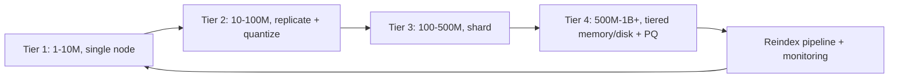

# Scaling Vector Search

## Beginner-Friendly Intuition

Scaling a vector search system is the same problem as scaling any
search-like system, with one extra constraint: vectors are large and
the index data structure (especially HNSW graphs) is expensive to
mutate. The same scaling moves apply (sharding, replication,
read/write splits, caching, multi-region), but the vector-specific
costs reshape the tradeoffs.

The intuition: at small scale, a single in-memory index on one node
serves everything. At medium scale, you replicate for availability and
maybe shard by tenant. At large scale, you partition the index across
many nodes, manage read/write topology carefully, balance memory and
disk indexes, and accept that some operations (full reindex) become
multi-hour jobs that need careful operational design.

A 2026 production-realistic mental model: under 10M vectors, single
node + a read replica or two. 10M to 100M, sharded HNSW with
replication. 100M to 1B, sharded with quantization, possibly
disk-resident. Above 1B, distributed with tiered storage and
asynchronous reindex pipelines.

## Formal Explanation

### Sharding strategies

When the index does not fit on one node:

- **By tenant.** One shard per organization. Natural multi-tenancy
  isolation. Cross-tenant queries are not a thing (often desired).
  Skewed if some tenants are much larger than others; mitigate with
  per-tenant shard size limits.
- **By topic / category.** Per-domain shards. Useful when queries
  always specify a category (medical journals, legal docs, code
  repos). Routing layer dispatches to the right shard.
- **By hash of vector ID.** Even distribution; cross-shard queries
  fan out to all shards. Common for general-purpose search.
- **Hierarchical / hybrid.** Coarse partition by tenant, fine partition
  by hash within the tenant. Used at very large scale.

Sharding by tenant is the most common pattern in B2B SaaS. Sharding by
hash is the most common pattern in consumer-facing systems where
queries do not specify a category.

### Fan-out cost

A query on a hash-sharded index of N shards has to query all N shards
and merge the top-K. Latency = max(per-shard latency) + merge cost.
With strict latency budgets, fan-out across more than 10-20 shards is
painful; per-shard tail latency dominates.

Optimizations:

- **Replicate per shard** for parallel querying.
- **Speculative retries** to a replica if a shard's response is slow.
- **Hedged requests** if you have spare capacity.
- **Selective fan-out** by routing to a subset based on a coarse
  classifier or filter.

### Replication

For availability and read throughput. Two patterns:

- **Synchronous replication.** Writes go to the leader, are
  replicated to followers before acking. Strong consistency, higher
  write latency.
- **Asynchronous replication.** Writes ack immediately; followers
  catch up on a delay. Eventual consistency; reads from a follower
  may miss recent inserts.

For semantic search, eventual consistency is usually acceptable
(documents indexed today are searchable in seconds, not milliseconds).
For permission-sensitive data, ensure ACL changes propagate fast
enough that revoked users do not still see content.

### Read/write split

Heavy writes (bulk reindex, embedding model upgrade) hurt query
latency on the same node. Standard pattern:

- **Write to a primary node** without serving queries during heavy
  ingestion.
- **Replicas serve queries** from a snapshot or from streaming
  replication.
- **Promote a replica to primary** during failover.

For HNSW, this is especially important because graph mutation
contends with query traversal. IVF tolerates concurrent writes
better.

### Memory vs disk indexes

The breakpoint when memory cost dominates:

- **In-memory HNSW.** Sub-10 ms p99. Memory cost is the binding
  constraint. Up to 100M-500M vectors with quantization on a single
  large node.
- **DiskANN / disk-resident indexes.** SSD-backed; only graph cache
  in memory. Latency 20-100 ms p99 (still production-acceptable for
  many cases). Memory cost drops 10-50x. Used at billion-scale.
- **Tiered.** Hot data in memory (last 30 days), cold on disk
  (everything older). The query layer routes by recency or by
  query type.

### Cold starts and warm-up

In-memory indexes (HNSW especially) take time to load from disk into
RAM. After a node restart, the first queries are slow until the
graph is paged in. Patterns:

- **Warm cache before serving traffic.** Run synthetic queries before
  marking the node healthy.
- **Memory-map the graph** so kernel page cache populates lazily.
- **Avoid cold starts in the hot path** by replicating and rolling
  restarts one node at a time.

### Index refresh strategies

Reindexing is expensive. Two common patterns:

- **Build new, swap in.** Build a new index in parallel from the
  source data; cutover reads to the new index when complete; retire
  the old. Standard for embedding model upgrades.
- **Incremental updates.** Insert new documents into the live index;
  periodically rebuild to compact (remove tombstones, optimize the
  graph).

For HNSW, incremental insertions degrade graph quality slightly over
time; a full rebuild every few months restores recall. For IVF,
re-clustering every 6-12 months keeps cluster centroids well-tuned
to the corpus.

### Throughput vs recall at scale

At very high QPS, every recall point costs latency and capacity.
Standard moves:

- **Lower `ef_search`** to spend less per query, accepting a small
  recall drop. A typical production tradeoff: 0.97 -> 0.95 recall in
  exchange for 30 percent more throughput.
- **Smaller-dim embeddings** (Matryoshka truncation, dimension
  reduction). Halve dimension, halve latency.
- **Pre-sharded routing** so each query touches fewer shards.
- **Quantization** (scalar int8 or PQ). Lower memory, slightly lower
  recall.
- **Caching** for popular queries. The cache key includes the query
  embedding bucket plus filters; hit rate above 30 percent
  meaningfully reduces backend load.

### Multi-region deployment

For latency-sensitive global users:

- **Replicate the index per region.** Writes go to a primary region
  and replicate asynchronously.
- **Per-region embedding pipelines** to avoid cross-region embedding
  cost (large for image and audio).
- **Tenant-pinned regions** for compliance (EU customer data stays
  in EU).

Multi-region multiplies operational complexity; do it only when
required by latency or compliance.

### Cost optimization at scale

The cost stack:

- **Embedding compute.** Either inference cost (hosted API per call)
  or GPU cost (self-hosted). Usually amortizable per document; query-
  time embedding is the recurring cost.
- **Vector storage.** Bytes per vector times count, times replication.
- **Query compute.** Per-query CPU/GPU time times QPS.
- **Reranker compute.** Often the largest item if a cross-encoder is
  used at high traffic.
- **Egress and storage transfer.**

At scale, the largest line items are often: reranker GPU, vector
storage in hosted services, and full-corpus reindex compute. Watch
each.

## Why It Matters in Real Jobs

Three production reasons. First, **the system that worked at 1M does
not work at 100M**. Architectural decisions made early (sharding,
replication, index choice) compound. Second, **scaling moves are
expensive** to retrofit; planning a year ahead saves migration pain.
Third, **cost grows non-linearly** without optimization; embedding
choice, dimension, and quantization decided badly add up to
substantial operational expense.

## How It Works Step by Step

1. **Estimate the scale curve.** Vectors today, in 6 months, in 12
   months, in 24 months.
2. **Identify the next breakpoint.** Single-node fits up to ~5M for
   pgvector, ~50M for HNSW with quantization on a large dedicated
   node. Plan for the next tier.
3. **Pick a sharding strategy** that matches the query pattern. By
   tenant for B2B SaaS; by hash for consumer-facing.
4. **Decide replication.** At least one read replica per shard for
   availability. Two for read throughput.
5. **Pick a memory tier strategy.** All-memory for low latency; tiered
   memory + disk for cost optimization at large scale; DiskANN for
   billion-scale.
6. **Plan the reindex pipeline.** Embedding model upgrades will
   happen; design the dual-index migration recipe before you need it.
7. **Cache where it makes sense.** Hot query embeddings, frequent
   query-result pairs.
8. **Monitor at every layer.** Per-shard recall, per-shard latency,
   replication lag, ingest backlog, cache hit rate.

## Real-World Example

A team's vector search starts at 2M vectors on a single pgvector
instance (8 GB index, 5 ms p99). Year 2: corpus grows to 30M; they
migrate to Qdrant on a dedicated 64 GB node, p99 stays under 15 ms.

Year 3: corpus reaches 250M; per-tenant isolation becomes mandatory.
They shard Qdrant by tenant: 1500 tenants across 12 nodes, each
holding 15-25 GB indexes. p99 stays under 20 ms thanks to
per-shard locality. They add a read replica per shard for availability;
ingestion runs against the primary, queries against either.

Year 4: corpus reaches 1.2B. Memory cost becomes prohibitive. They
introduce two-tier storage: last-90-days hot vectors stay on Qdrant
HNSW (50M, in-memory); the cold tier moves to a DiskANN-style index
on SSD. Routing layer dispatches by query freshness and a small
classifier. p99 latency rises to 80 ms for cold queries (acceptable
for the use case). Total memory cost drops 60 percent.

Year 5: a multilingual embedding model upgrade is pending. They build
a parallel index over 4 weeks (running embedding pipelines around the
clock on a dedicated GPU pool), dual-write for two weeks, switch reads,
and retire the old index. NDCG@10 lifts 4 points; no downtime.

The lesson: each scale tier had a different bottleneck. Memory at one
tier; latency at another; reindex throughput at the next. The
architecture evolved with the corpus.

## Common Mistakes

- Designing for current scale, not 12-24 months out. Migration is
  painful; some moves require rebuilding from scratch.
- Sharding by hash when queries always specify a tenant. Missing the
  free locality.
- Sharding by tenant in a system with skew (a few huge tenants). One
  hot shard becomes the bottleneck.
- Single replica for availability. One node failure = downtime.
- All-in-memory at billion scale. Cost dominates the budget.
- Synchronous replication when eventual is fine. Write latency
  inflated for no reason.
- Not planning the reindex pipeline. The first embedding upgrade
  becomes a multi-week emergency.
- Caching without including ACL or filter signature in the cache key.
  Permission leakage at the cache layer.
- Forgetting cold-start warm-up. Rolling restarts cause query latency
  spikes.

## Interview Angle

**Question:** Walk through how you would scale a vector search system
from 1M to 1B vectors over 24 months.

**Strong answer:** Each scale tier has a different bottleneck. The
architecture evolves with the corpus.

**Tier 1 (1M-10M).** Single node, in-memory HNSW, single replica.
pgvector if Postgres is in the stack; Qdrant or similar if not.
Latency is easy; recall is easy; operations are simple. Spend
effort on building the eval harness, embedding model selection, and
reranker if needed.

**Tier 2 (10M-100M).** Single dedicated node still feasible if
memory budget allows (a 64 GB node holds 50M float32 1024-dim
vectors with HNSW). Add scalar quantization (int8) for 4x memory
savings at <1 percent recall loss. Add at least one read replica
for availability. Start watching p99 latency under load. Plan the
reindex recipe even if not yet needed.

**Tier 3 (100M-500M).** Single node no longer fits in memory. Choices.

- **Sharded HNSW with quantization.** Shard by tenant or hash, 5-20
  shards across nodes. Replicate each shard for availability. Fan-out
  on hash queries; tenant-direct routing on tenant queries.
- **DiskANN on SSD.** Single (or small number of) nodes with much
  larger memory-cheap capacity. Latency rises to 50-100 ms; OK for
  many use cases. Lower memory cost.

I would lean toward sharded in-memory if latency under 30 ms is
required, and DiskANN otherwise. Pick by latency budget.

**Tier 4 (500M-1B+).** Tiered storage becomes essential. Hot tier
(recent or popular) in memory; cold tier on disk. Routing layer
dispatches by recency or query type. Aggressive quantization (PQ
with 64-byte codes) plus reranking on raw vectors recovers recall
with one-twentieth the memory.

Cross-cutting concerns at every tier.

- **Reindex pipeline** ready before needed. Dual-index migration
  recipe for embedding model upgrades. Plan for a 7-30 day window.
- **Per-shard monitoring**: recall, latency, replication lag, ingest
  backlog. Aggregate metrics hide per-shard failures.
- **Cost monitoring**: vector storage, query compute, reranker GPU,
  embedding inference. Identify the largest line item; target
  optimizations there.
- **ACL and permission propagation latency** must scale: a million-
  document permission update should propagate in seconds to
  minutes, not hours.

What I would not do at any tier: ignore monitoring of per-shard
recall (silent quality regression), use synchronous replication
without a reason (write latency penalty), let the index grow without
periodic rebuild (HNSW graph degrades), or hardcode a single-region
deployment when multi-region compliance is on the roadmap.

The general principle: each tier introduces one new operational
challenge. Plan for the tier above the one you are in; do not
over-engineer for a tier you may never reach.

**Weak answer:** "Use a hosted vector DB and scale up the plan."
Ignores cost, sharding, reindex, and tiered storage.

**Follow-up questions:**

- How would you handle a hot tenant that takes 80 percent of one
  shard's traffic?
- What is DiskANN and when do you reach for it?
- How would you do an embedding model migration at 100M vectors?
- What metrics would you watch for silent quality regressions?

## Mini Exercise

Sketch the scaling plan for a vector search system you might build:
launch scale, year-1 scale, year-3 scale. For each tier, identify the
expected bottleneck and the architectural move that addresses it.

## Diagram

---
## Navigation

[⬅ Previous](08-vector-db-selection.md) | [🏠 Home](../README.md) | [➡ Next](10-vector-database-interview-patterns.md)
