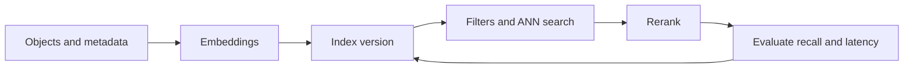

# Vector Database Interview Patterns

## Beginner-Friendly Intuition

Vector database interviews test whether you understand semantic retrieval as a system design problem.
Embeddings matter, but so do indexing, metadata filters, recall, latency, updates, permissions,
reranking, cost, and operational debugging.

The recurring pattern is to start with the retrieval goal, choose an embedding and similarity setup,
decide how metadata constrains results, measure recall and latency, then add approximate indexes and
rerankers only when the baseline proves what is missing.

## Formal Explanation

A vector database answer should specify:

- **Objects and queries:** what is embedded, what users ask, and what a relevant result means.
- **Embedding contract:** model, dimensionality, normalization, version, language coverage, and
  update strategy.
- **Index design:** exact search baseline, HNSW, IVF, product quantization, sharding, replication,
  and memory or storage tradeoffs.
- **Filtering and ranking:** metadata schema, pre-filter versus post-filter behavior, hybrid search,
  reranking, and diversity.
- **Evaluation:** recall at k, MRR, NDCG, latency percentiles, freshness, cost, and permission
  correctness.
- **Operations:** re-embedding, backfills, index versioning, deletes, drift, monitoring, and rollback.

## Why It Matters in Real Jobs

Vector search fails when semantically similar is not the same as useful. A result can be close in
embedding space but wrong for the user's permission, language, freshness need, product segment, or
exact keyword constraint. Approximate indexes can also trade recall for speed in ways that are hard
to notice without evaluation.

Interviewers want to see that you can design retrieval that is measurable, debuggable, and safe for
the product surface.

## How It Works Step by Step

1. **Clarify relevance.** Define what counts as a correct result and which metadata constraints are
   mandatory.
2. **Build lexical and exact baselines.** Use BM25 and exact vector search on a sample before ANN.
3. **Choose embeddings.** Match model to language, domain, length, and update frequency.
4. **Design metadata filtering.** Decide which fields must be filterable before ranking.
5. **Add ANN indexing.** Tune HNSW or IVF settings against recall, latency, memory, and cost.
6. **Rerank if needed.** Use cross-encoders or business rules when top-k recall is acceptable but
   ordering is weak.
7. **Operate versions.** Track embedding model, index build, document version, and deletion state.

## Real-World Example

For developer documentation search, embed passages with source path, product version, language,
permission, heading, and last-updated metadata. Start with BM25 and exact vector search on a labeled
sample. If dense search improves semantic recall but misses exact API names, use hybrid retrieval.
If top results are relevant but poorly ordered, add a reranker.

The system should monitor recall on judged queries, zero-result rate, latency, stale-document
results, and permission violations. Re-embedding should use a new index version so rollback is
possible if retrieval quality drops.

## Common Mistakes

- Assuming vector search replaces lexical search.
- Ignoring metadata filters until after the index is built.
- Measuring only latency and not recall.
- Changing embedding models without rebuilding and versioning the index.
- Forgetting deletes, freshness, and permission updates.
- Using approximate search without comparing it to exact search.
- Treating top-k as a fixed constant instead of a quality, cost, and context-budget tradeoff.

## Interview Angle

Interviewers use vector database prompts to test retrieval engineering.

**Question:** Your semantic search system is fast but misses important results. What do you inspect?

**Strong answer:** Compare ANN output to exact search, measure recall at k, inspect embedding
coverage, check filters and chunking, compare BM25 and hybrid search, tune index parameters, and add
reranking only after verifying candidate recall.

**Weak answer:** Increase the vector database size or switch vendors without measuring retrieval
failure.

**Follow-up questions:**

- When would you use pre-filtering instead of post-filtering?
- How do HNSW settings affect recall and latency?
- How do you handle an embedding model upgrade?
- What should be logged for retrieval debugging?

## Mini Exercise

Design vector search for one corpus: product catalog, support docs, code snippets, or user memories.
List object schema, metadata fields, baseline, embedding model requirements, index choice, metrics,
and rollback plan.

## Diagram

---
## Navigation

[⬅ Previous](09-scaling-vector-search.md) | [🏠 Home](../README.md) | [➡ Next](../rag/01-what-is-rag.md)
